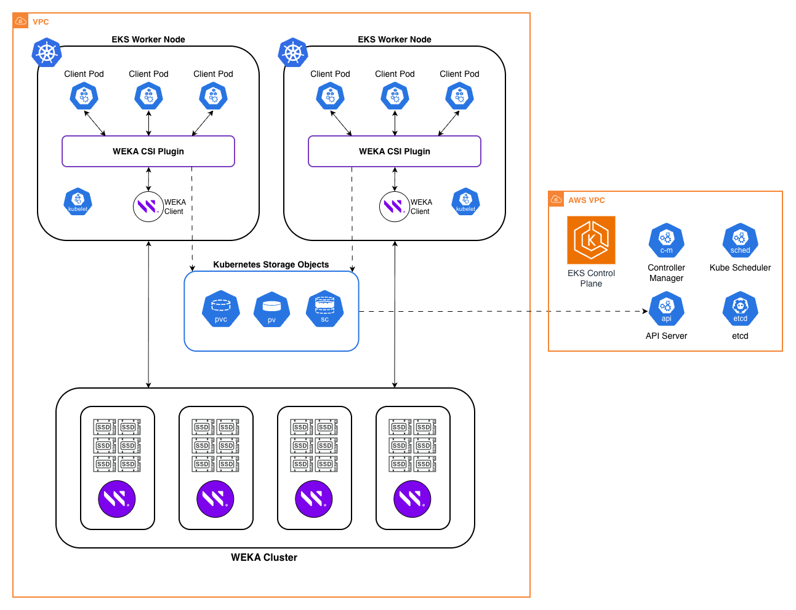

# WEKA on Amazon EKS

Deploy WEKA distributed storage on Amazon EKS using the WEKA Operator.

<p align="center">
  
</p>

## Deployment Models

### [weka-dedicated](weka-dedicated/)

A WEKA storage cluster is created with dedicated backend instances.
EKS worker nodes run WEKA client containers that connect to the
backend over the network. Applications access WEKA storage via the
CSI plugin and PersistentVolumeClaims.

### [weka-axon](weka-axon/)

WEKA backend and client processes run together on the same EKS
nodes. Each node contributes local NVMe storage to the distributed
filesystem while also running application workloads.

### [hyperpod-dedicated](hyperpod-dedicated/)

Similar to weka-dedicated, with a standalone WEKA storage cluster
and an EKS cluster for worker nodes and application pods. However,
client instances are provisioned and managed by SageMaker HyperPod,
and then added to the EKS cluster as worker nodes.

### [hyperpod-axon](hyperpod-axon/)

Similar to weka-axon, but SageMaker HyperPod provisions the
underlying EC2 instances. Those instances are added to an EKS
cluster, where they're used for deploying both the WEKA cluster
and worker pods.

## Deployment

Each deployment model is self-contained; see its README for
step-by-step instructions. Shared Terraform modules
([EKS](modules/eks/), [weka-backend](modules/weka-backend/)) and
shared deployment scripts ([scripts/](scripts/)) live at the repo
root. Each deployment model's local `deploy.sh` and
`generate-manifests.sh` are thin shims that invoke the canonical
versions in `scripts/` with the appropriate `--module` flag.

### Prerequisites

- AWS CLI configured with appropriate permissions
- Existing VPC with subnets (private subnets recommended)
- Terraform >= 1.5
- kubectl, Helm 3.x
- WEKA download token from [get.weka.io](https://get.weka.io)
- Quay.io credentials for WEKA container images (available at
  [get.weka.io](https://get.weka.io))

### How It Works

WEKA integrates with Kubernetes using the standard CSI
(Container Storage Interface) pattern:

```text
┌──────────────────────────────────────────────────────────────────────┐
│                         Kubernetes Cluster                           │
│                                                                      │
│  1. WEKA Operator          2. CSI Plugin           3. Your Pods      │
│  ┌─────────────────┐       ┌─────────────────┐     ┌──────────────┐  │
│  │ Deploys WEKA    │       │ Provisions PVs  │     │ Mount WEKA   │  │
│  │ client pods on  │  ──▶  │ from WEKA       │ ──▶ │ via PVC      │  │
│  │ selected nodes  │       │ filesystem      │     │              │  │
│  └─────────────────┘       └─────────────────┘     └──────────────┘  │
│         │                                                            │
│         ▼                                                            │
│  ┌─────────────────┐                                                 │
│  │ WekaClient CRD  │  Runs WEKA client process on nodes with         │
│  │                 │  label: weka.io/supports-clients=true           │
│  └─────────────────┘                                                 │
└──────────────────────────────────────────────────────────────────────┘
```

### Deployment Flow

The general flow for a deployment is:

1. Deploy Infrastructure

   - A `terraform.tfvars.example` is provided as a starting point
   - Terraform builds the WEKA backend (dedicated) and/or the
     EKS cluster, depending on the deployment model
   - Assumes existing infrastructure (e.g. VPC, subnets)

2. Deploy the WEKA Operator

   - A Helm chart installs the operator

3. Deploy WEKA resources

   - `WekaCluster` (axon) and `WekaClient` CRs
   - Core manifests are provided

4. Install the CSI plugin

   - Bundled with the operator in axon, installed separately in dedicated

5. Test with a PVC and pod

   - Examples are provided for creating a `StorageClass` and `PVC`
     that application pods can use
