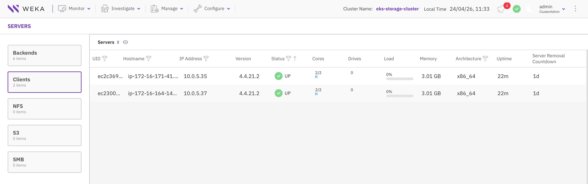

# WEKA Dedicated on EKS with SageMaker HyperPod

Deploy WEKA client containers on SageMaker HyperPod-managed worker
nodes joined to an EKS cluster, connected to a standalone WEKA
backend storage cluster.

## Architecture

<!-- TODO: Add architecture diagram -->
<!--  -->

- **WEKA Backend**: 6+ i3en instances with NVMe storage
  ([terraform/weka-backend/](terraform/weka-backend/README.md))
- **EKS Cluster**: System nodes only; HyperPod provides workers
  ([terraform/eks/](terraform/eks/README.md))
- **HyperPod**: Worker nodes managed by SageMaker, joined to EKS
  ([terraform/hyperpod/](terraform/hyperpod/README.md))

## Prerequisites

- AWS CLI configured with appropriate permissions
- Existing VPC with subnets (see AWS's [HyperPod EKS prerequisites](https://docs.aws.amazon.com/sagemaker/latest/dg/sagemaker-hyperpod-eks-prerequisites.html))
- Terraform >= 1.5
- kubectl, Helm 3.x
- WEKA download token from [get.weka.io](https://get.weka.io)
- Quay.io credentials for WEKA container images (available at
  [get.weka.io](https://get.weka.io))

## Directory Structure

The module is organized as:

- `terraform/`: Terraform for the WEKA backend, EKS cluster, and HyperPod cluster
- `lifecycle-scripts/`: HyperPod node provisioning (hugepages, NIC setup)
- `manifests/`: Kubernetes manifests (WekaClient, CSI, NIC annotator, test pods)
- `deploy.sh`: automated deployment script
- `generate-manifests.sh`: generates `weka-client.yaml` and CSI API
  secret from the deployed backend

```text
hyperpod-dedicated/
├── terraform/
│   ├── weka-backend/      # WEKA storage cluster
│   ├── eks/               # EKS cluster (system nodes only)
│   └── hyperpod/          # SageMaker HyperPod cluster
├── lifecycle-scripts/     # HyperPod node boot scripts
├── manifests/             # Kubernetes manifests
│   ├── core/              # Required manifests (weka-client, CSI, NIC annotator, etc.)
│   └── test/              # Test PVC and pods
├── generate-manifests.sh  # Generate weka-client.yaml and CSI secret from backend
└── deploy.sh              # Automated deployment script
```

---

## Deploy Infrastructure

This guide defaults to a minimum working example that runs on a
single-ENI instance like `ml.c5.12xlarge` in UDP mode, so you can
deploy end-to-end without provisioning a large, expensive instance
(e.g. `ml.p5.48xlarge`). Production deployments on DPDK-capable
GPU instances need a few specific values changed (NIC count,
hugepages sizing, UDP → DPDK); those are called out inline where
they apply.

### 1. Deploy WEKA Backend

The backend module wraps the official
[WEKA AWS](https://registry.terraform.io/modules/weka/weka/aws/latest)
Terraform module. It creates an Auto Scaling group of instances
(with local NVMe for WEKA storage) and the IAM/Lambda
machinery that forms the WEKA cluster at boot.

Start by copying the example variables file:

```bash
cd terraform/weka-backend
cp terraform.tfvars.example terraform.tfvars
```

#### 1.1 Configure Terraform

Edit `terraform.tfvars`. Key variables:

- `region`
- `cluster_name` (tagged on all WEKA instances)
- `cluster_size` (minimum 6 for a valid WEKA cluster)
- `instance_type` (i3en or i8ge)
- `key_pair_name` (EC2 key pair for SSH)
- `get_weka_io_token` (from [get.weka.io](https://get.weka.io))
- `subnet_ids` (single AZ; all backend instances share one
  placement group)

See [terraform/weka-backend/README.md](terraform/weka-backend/README.md)
for the full variable reference.

#### 1.2 Terraform Deployment

Create the backend cluster (takes 10-15 minutes):

```bash
terraform init && terraform apply
```

You'll need the backend IPs and admin password in later steps.
Commands for both are shown at point of use.

#### 1.3 Verify Deployment

The WEKA backend ships with a status Lambda you can invoke to watch
cluster formation:

```bash
aws lambda invoke \
  --function-name weka-<cluster_name>-status-lambda \
  --payload '{"type": "progress"}' \
  --region <region> \
  --cli-binary-format raw-in-base64-out /dev/stdout 2>/dev/null | jq
```

During installation, instances download and install WEKA (takes a
few minutes). `summary.clusterized` is `false` while work is in
progress:

```json
{
  "ready_for_clusterization": null,
  "progress": {
    "ip-10-0-67-159.us-west-2.compute.internal": [
      "08:10:48 UTC: Downloading weka install script",
      "08:10:49 UTC: Installing weka"
    ],
    "ip-10-0-67-15.us-west-2.compute.internal": [
      "08:10:50 UTC: Downloading weka install script",
      "08:10:52 UTC: Installing weka"
    ]
  },
  "in_progress": [
    "ip-10-0-67-159.us-west-2.compute.internal",
    "ip-10-0-67-15.us-west-2.compute.internal"
  ],
  "summary": {
    "in_progress": 6,
    "clusterization_target": 6,
    "clusterized": false
  }
}
```

Once clusterization completes, `summary.clusterized` flips to
`true` and the designated "Clusterization" instance shows the
full bootstrap log:

```json
{
  "ready_for_clusterization": null,
  "progress": {
    "ip-10-0-67-159.us-west-2.compute.internal": [
      "08:10:48 UTC: Downloading weka install script",
      "08:10:49 UTC: Installing weka",
      "08:12:46 UTC: Weka software installation completed",
      "08:13:22 UTC: Weka containers are ready",
      "08:13:24 UTC: This (i-0900eefb0731eed34) is instance 3/6 that is ready for clusterization"
    ],
    "ip-10-0-67-15.us-west-2.compute.internal": [
      "08:11:14 UTC: Downloading weka install script",
      "08:11:15 UTC: Installing weka",
      "08:13:09 UTC: Weka software installation completed",
      "08:13:39 UTC: Weka containers are ready",
      "08:13:43 UTC: This (i-014f09587d90b25d4) is instance 6 that is ready for clusterization",
      "08:13:44 UTC: Running Clusterization",
      "08:14:42 UTC: Adding drives",
      "08:16:10 UTC: Running start-io",
      "08:16:59 UTC: Clusterization completed successfully",
      "08:17:01 UTC: Skipping OBS setup"
    ]
  },
  "in_progress": null,
  "summary": {
    "in_progress": 0,
    "clusterization_target": 6,
    "clusterized": true
  }
}
```

You can start deploying the EKS cluster while this is in progress,
but `clusterized` should be `true` before you install the WEKA
operator.

### 2. Deploy EKS Cluster

Provision the EKS control plane and node groups with Terraform.
Start by copying the example variables file:

```bash
cd ../eks
cp terraform.tfvars.example terraform.tfvars
```

#### 2.1 Configure Terraform

Edit `terraform.tfvars`. Key variables:

- `region`
- `cluster_name`
- `subnet_ids`: same VPC as the WEKA backend
- `admin_role_arn` (IAM role for cluster admin access)
- `enable_ssm_access` (enabled by default for node debugging)
- `additional_security_group_ids`: include the WEKA backend SG so
  HyperPod nodes (joined later) can reach the backend

See [terraform/eks/README.md](terraform/eks/README.md) for the full
variable reference.

#### 2.2 Node Groups

Only a `system` node group is defined here; HyperPod provisions
and joins the client worker nodes to this cluster in
[section 4](#4-deploy-hyperpod-cluster).

```hcl
node_groups = {
  system = {
    instance_types = ["m6i.large"]
    desired_size   = 2
    min_size       = 2
    max_size       = 2
    labels = {
      "node-role" = "system"
    }
  }
}
```

#### 2.3 Terraform Deployment

Create the EKS cluster (takes about 10-15 minutes):

```bash
terraform init && terraform apply

# Configure kubectl
$(terraform output -raw configure_kubectl)
```

Confirm the system nodes are `Ready`:

```bash
kubectl get nodes

NAME                                        STATUS   ROLES    AGE   VERSION
ip-10-0-0-217.us-west-2.compute.internal    Ready    <none>   45m   v1.33.8-eks-f69f56f
ip-10-0-7-51.us-west-2.compute.internal     Ready    <none>   45m   v1.33.8-eks-f69f56f
```

At this point only system nodes exist. Next, HyperPod provisions
the EC2 instances and joins them to the EKS cluster.

### 3. Prepare HyperPod Cluster

Two prerequisites before deploying the HyperPod cluster:

1. **Install the `hyperpod-dependencies` Helm chart on EKS** (§3.1
   below). Without this, HyperPod cluster creation may fail and
   resiliency features (node auto-recovery, deep health checks)
   won't work.
2. **Have the WEKA lifecycle scripts ready in S3** (§3.2; Terraform
   uploads them automatically during deployment).

#### 3.1 Install HyperPod Dependencies

The chart is published in the
[sagemaker-hyperpod-cli](https://github.com/aws/sagemaker-hyperpod-cli)
repository. See AWS's [Installing packages on the Amazon EKS
cluster using Helm](https://docs.aws.amazon.com/sagemaker/latest/dg/sagemaker-hyperpod-eks-install-packages-using-helm-chart.html)
for the official install procedure. The chart installs:

- **Health monitoring agent** (`aws-hyperpod` namespace): required
  for `auto_node_recovery = true` to replace unhealthy nodes
- **Deep health check** RBAC
- **`job-auto-restart`** RBAC (auto-restart for PyTorch jobs)
- **Kubeflow Training / MPI operators**
- Device plugins: NVIDIA (GPU), Neuron (Trainium / Inferentia),
  AWS EFA (conditional on instance type)

Clone the repo outside this module and install:

```bash
# We only need the helm_chart/ subdirectory from this repo, not the CLI
git clone https://github.com/aws/sagemaker-hyperpod-cli.git /tmp/sagemaker-hyperpod-cli

helm dependencies update /tmp/sagemaker-hyperpod-cli/helm_chart/HyperPodHelmChart
helm upgrade --install hyperpod-dependencies \
  /tmp/sagemaker-hyperpod-cli/helm_chart/HyperPodHelmChart \
  --namespace kube-system

NAME: hyperpod-dependencies
LAST DEPLOYED: Mon Feb 16 09:33:23 2026
NAMESPACE: kube-system
STATUS: deployed
REVISION: 1
DESCRIPTION: Install complete
TEST SUITE: None
```

Verify:

```bash
helm list -n kube-system

NAME                    NAMESPACE     REVISION  UPDATED      STATUS    CHART                       APP VERSION
hyperpod-dependencies   kube-system   1         <timestamp>  deployed  hyperpod-helm-chart-0.1.0   1.16.0
```

#### 3.2 Review Lifecycle Scripts

HyperPod invokes a user-provided `on_create` script at instance
boot — the hook for host-level customization on top of the DLAMI.
On EKS, most node customization can be done with Kubernetes-native
patterns (DaemonSets, init containers). We use lifecycle scripts
for things that can't run in a pod: allocating hugepages, preparing
NICs for use with WEKA, and pointing containerd's data root at the
secondary EBS volume.

Our scripts live in [lifecycle-scripts/](lifecycle-scripts/) and
Terraform uploads them to S3 during
[HyperPod cluster deployment](#4-deploy-hyperpod-cluster):

| Script | Purpose |
| ------ | ------- |
| `on_create.sh` | Entrypoint invoked by SageMaker at boot. Points containerd's data root at `/opt/sagemaker` (the secondary EBS) if mounted, sources `weka-config.env`, and invokes the hugepages / NIC scripts when their counts are > 0. |
| `configure-weka-hugepages.sh` | Allocates 2 MiB hugepages for WEKA and installs a systemd oneshot so the count persists across reboots. Driven by `WEKA_HUGEPAGES_COUNT`. |
| `configure-hyperpod-nics.py` | Moves `WEKA_NIC_COUNT` NICs from the SageMaker netns to the host and writes `/var/lib/weka/hyperpod-nics.json` for the [NIC annotator DaemonSet](#22-nic-annotator) to publish to the operator. Auto-detects subnet CIDR via IMDS. Only applies to instance types that pre-provision extra ENIs (see the note in [§4.1](#41-configure-terraform)). |
| `weka-config.env.tftpl` | Terraform-rendered env file that exports `WEKA_HUGEPAGES_COUNT` and `WEKA_NIC_COUNT` for the scripts above to consume. |

All files land under `s3://<s3_bucket_name>/<s3_key_prefix>/`
(default prefix `hyperpod-lifecycle`). The HyperPod cluster config
references the bucket URI and the `on_create.sh` entrypoint.

To change per-node WEKA config, edit `weka_hugepages_count` and
`weka_nic_count` in `terraform/hyperpod/terraform.tfvars`, then
`terraform apply`; the file etag changes and Terraform re-uploads
to S3. Replacing a node in HyperPod (see
[Cycling a Node](#cycling-a-node)) then re-runs `on_create.sh`
on the new instance and picks up the new values.

**Alternative: custom AMI.** HyperPod supports
[custom AMIs](https://docs.aws.amazon.com/sagemaker/latest/dg/hyperpod-custom-ami-support.html)
built from the DLAMI base. Baking hugepages and NIC setup into the
AMI replaces these scripts — faster boot, but you rebuild and rotate
the AMI whenever settings change.

### 4. Deploy HyperPod Cluster

Provision the SageMaker HyperPod cluster. Terraform uploads the
lifecycle scripts (per §3.2) and creates the cluster.

Start by copying the example variables file:

```bash
cd ../hyperpod
cp terraform.tfvars.example terraform.tfvars
```

#### 4.1 Configure Terraform

Edit `terraform.tfvars`. Key variables:

- `region`
- `hyperpod_cluster_name`
- `eks_cluster_arn`: from `terraform/eks` outputs
- `subnet_ids`: same subnet as the WEKA backend (single AZ for
  intra-cluster performance)
- `additional_security_group_ids`: SGs attached to HyperPod nodes.
  Typically the same SG used by your EKS nodes and WEKA backend so
  cluster-wide traffic works via shared-SG self-rules.
- `create_efa_security_group` (default `true`): create + attach an
  EFA-compliant SG (self-only ingress/egress). Required on
  `ml.p4d.*`, `ml.p5.*`, etc. to pass HyperPod's EFA health check.
- `s3_bucket_name`: bucket for lifecycle scripts. Terraform creates
  it by default; set `create_s3_bucket = false` to reuse an existing
  bucket
- `instance_groups`: list of HyperPod instance groups (`name`,
  `instance_type`, `instance_count`, `ebs_volume_size_in_gb`,
  `threads_per_core`, `labels`, `taints`). Labels and taints land
  on every node in the group via HyperPod's native
  [KubernetesConfig](https://docs.aws.amazon.com/sagemaker/latest/dg/sagemaker-hyperpod-eks-custom-labels-and-taints.html).
- `weka_hugepages_count`, `weka_nic_count`: per-node WEKA
  configuration (shared across all instance groups)
- `create_sagemaker_execution_role` (default `true`): creates an
  IAM role for the HyperPod instances

See [terraform/hyperpod/README.md](terraform/hyperpod/README.md)
for the full variable reference.

> **`weka_nic_count` depends on instance type.** The NIC move
> applies only to instance types where HyperPod pre-provisions
> dedicated ENIs in the SageMaker network namespace (e.g. the
> `ml.p5.*` family). General-purpose types like `ml.c5.*`,
> `ml.m6i.*` have only the primary ENI; set `weka_nic_count = 0`
> and run the WekaClient in UDP mode.

<!-- -->

> **Sizing `weka_hugepages_count`.** Per-container hugepages use
> the standard WEKA formula: `(1500 × clientCores) + (64 × clientCores)`
> plus an offset of `200 + (64 × clientCores)`. Match the Terraform
> value to your planned `clientCores` with ~20% headroom, rounded
> up to a multiple of 1024. For a 2-core client: 3456 MiB →
> **2048 pages** (4096 MiB). See
> [weka-dedicated §2.1 Hugepages](../weka-dedicated/README.md#21-hugepages)
> for a full per-container worked example.

#### 4.2 Terraform Deployment

Create the HyperPod cluster (takes about 10-15 minutes for
instances to provision and run lifecycle scripts):

```bash
terraform init && terraform apply
cd ../..
```

#### 4.3 Verify HyperPod Nodes Joined EKS

Confirm the HyperPod cluster status is `InService`:

```bash
aws sagemaker describe-cluster \
  --cluster-name <hyperpod_cluster_name> \
  --region <region> \
  --query 'ClusterStatus' --output text

InService
```

Once the cluster is `InService` and the lifecycle scripts have
finished, the instances register themselves as EKS nodes. Confirm
they show up:

```bash
kubectl get nodes -l sagemaker.amazonaws.com/compute-type=hyperpod

NAME                           STATUS   ROLES    AGE   VERSION
hyperpod-i-0abcdef1234567890   Ready    <none>   28h   v1.33.5-eks-ecaa3a6
hyperpod-i-0123456789abcdef0   Ready    <none>   30h   v1.33.5-eks-ecaa3a6
```

Check that the HyperPod health monitoring agent has marked every
node `Schedulable`:

```bash
kubectl get nodes -l sagemaker.amazonaws.com/compute-type=hyperpod \
  -o custom-columns=\
NAME:.metadata.name,\
HEALTH:.metadata.labels.sagemaker\\.amazonaws\\.com/node-health-status

NAME                           HEALTH
hyperpod-i-0abcdef1234567890   Schedulable
hyperpod-i-0123456789abcdef0   Schedulable
```

See AWS's [resiliency node labels](https://docs.aws.amazon.com/sagemaker/latest/dg/sagemaker-hyperpod-eks-resiliency-node-labels.html)
reference for all possible values (`Unschedulable`,
`UnschedulablePendingReplacement`, etc.).

If `weka_hugepages_count > 0`, confirm kubelet sees the allocated
pages:

```bash
kubectl get nodes -l sagemaker.amazonaws.com/compute-type=hyperpod \
  -o custom-columns=\
NAME:.metadata.name,\
HUGEPAGES_2Mi:.status.allocatable.hugepages-2Mi

NAME                           HUGEPAGES_2Mi
hyperpod-i-0abcdef1234567890   4Gi
hyperpod-i-0123456789abcdef0   4Gi
```

`HUGEPAGES_2Mi` should equal `weka_hugepages_count × 2 MiB` (e.g.
2048 pages → `4Gi`). If it's `0` or the wrong value, check the
lifecycle-script CloudWatch log for the hugepages step.

If `weka_nic_count > 0`, the NIC move output appears in the same
CloudWatch log stream. Node-level annotation verification happens in
[§2.2](#22-nic-annotator) after the annotator deploys.

If nodes don't appear after 10-15 minutes, see
[Troubleshooting](#troubleshooting).

---

## Automated Setup

Once the Terraform modules are applied, `deploy.sh` handles
everything else: manifest generation, HyperPod node label
verification, operator install, NIC annotator, WekaClient, CSI plugin,
StorageClass, and test pods.

If you'd rather walk through each step by hand, skip to
[Manual Setup](#manual-setup).

```bash
./deploy.sh \
  --cluster-name weka-hyperpod-eks \
  --quay-username myuser \
  --quay-password mypass \
  --backend-name hyperpod-storage \
  --secret-arn arn:aws:secretsmanager:us-west-2:123456:secret:weka/...
```

When `--backend-name` and `--secret-arn` are provided, the script
runs `generate-manifests.sh` internally to produce `weka-client.yaml`
and `csi-wekafs-api-secret.yaml` from the backend's IPs and Secrets
Manager password. If you've already generated the manifests
manually, omit those two flags.

All flags can alternatively be set via environment variables:

| Flag | Environment Variable | Description |
| ---- | -------------------- | ----------- |
| `--cluster-name` | `CLUSTER_NAME` | EKS cluster name |
| `--quay-username` | `QUAY_USERNAME` | Quay.io username |
| `--quay-password` | `QUAY_PASSWORD` | Quay.io password |
| `--backend-name` | `WEKA_BACKEND_NAME` | WEKA backend tag (auto-generates manifests) |
| `--secret-arn` | `WEKA_SECRET_ARN` | Secrets Manager ARN for WEKA password |
| `--region` | `AWS_REGION` | AWS region |
| `--operator-version` | `WEKA_OPERATOR_VERSION` | Operator chart version (default: `v1.11.0`) |

Run `./deploy.sh --help` for all options.

To regenerate manifests standalone (e.g. for manual review before
deploy), run `./generate-manifests.sh --help`.

Once `deploy.sh` finishes, head to
[Verify WEKA Processes](#4-verify-weka-processes) to check the
cluster and running processes.

See [Cleanup](#cleanup) for teardown instructions.

---

## Manual Setup

All commands assume you are in the `hyperpod-dedicated/` directory.

### 1. Deploy WEKA Operator

The [WEKA Operator](https://docs.weka.io/kubernetes/weka-operator-deployments)
manages WEKA storage components via Kubernetes Custom Resources
(WekaClient, WekaPolicy). The CSI plugin is installed separately
in a later step.

Create the namespace:

```bash
kubectl create namespace weka-operator-system
```

Create the Quay pull secret:

```bash
kubectl create secret docker-registry weka-quay-io-secret \
  --namespace weka-operator-system \
  --docker-server=quay.io \
  --docker-username=<QUAY_USERNAME> \
  --docker-password=<QUAY_PASSWORD>
```

Install the operator:

```bash
helm upgrade --install weka-operator \
  oci://quay.io/weka.io/helm/weka-operator \
  --namespace weka-operator-system \
  --version v1.11.0 \
  --set imagePullSecret=weka-quay-io-secret \
  -f manifests/core/values-weka-operator.yaml \
  --wait
```

Output:

```bash
Release "weka-operator" does not exist. Installing it now.
Pulled: quay.io/weka.io/helm/weka-operator:v1.11.0
Digest: sha256:646b7ab0f71b170ba8be24b44af08ae04f261034c66cbca451478211e614e854
NAME: weka-operator
LAST DEPLOYED: Mon Apr 13 09:05:43 2026
NAMESPACE: weka-operator-system
STATUS: deployed
REVISION: 1
DESCRIPTION: Install complete
TEST SUITE: None
NOTES:
Chart: weka-operator
Release: weka-operator
```

Verify the pods have deployed:

```bash
kubectl get pods -n weka-operator-system

NAME                                                READY   STATUS    RESTARTS   AGE
weka-operator-controller-manager-7977d977fd-hwsxc   2/2     Running   0          81s
weka-operator-node-agent-2pwsb                      1/1     Running   0          82s
weka-operator-node-agent-489fr                      1/1     Running   0          82s
```

You should see one `controller-manager` pod (on system nodes) and
one `node-agent` per WEKA node.

### 2. Prepare HyperPod Nodes

The WEKA operator targets nodes labeled `weka.io/supports-clients=true`
and tolerates the `weka.io/client=true:NoSchedule` taint. Both are
applied by Terraform at cluster creation via the instance group's
`labels` / `taints` fields (see [§4.1](#41-configure-terraform));
HyperPod adds its own
`sagemaker.amazonaws.com/compute-type=hyperpod` label on top.
Hugepages and NIC setup happen at node boot via the lifecycle
scripts, and the NIC annotator DaemonSet publishes that info to
the operator.

#### 2.1 Verify Node Labels and Taints

```bash
kubectl get nodes -l sagemaker.amazonaws.com/compute-type=hyperpod \
  -o 'custom-columns=NAME:.metadata.name,SUPPORTS_CLIENTS:.metadata.labels.weka\.io/supports-clients,TAINTS:.spec.taints[*].key'

NAME                           SUPPORTS_CLIENTS   TAINTS
hyperpod-i-0abcdef1234567890   true               weka.io/client
hyperpod-i-0123456789abcdef0   true               weka.io/client
```

Every HyperPod node should show `SUPPORTS_CLIENTS=true` and a
`TAINTS` column that includes `weka.io/client`. If either is
missing, check the `labels` / `taints` blocks in
`terraform/hyperpod/terraform.tfvars` and `terraform apply` to
push the updated `KubernetesConfig` to the cluster.

#### 2.2 NIC Annotator

> **Only applies when `weka_nic_count > 0`.** On single-ENI
> instance types (`ml.c5.*`, `ml.m6i.*`) there are no extra ENIs
> to annotate; skip to [§3 Deploy WEKA Client](#3-deploy-weka-client).

Standard EKS uses the operator's `ensure-nics` WekaPolicy to
create and attach ENIs. HyperPod pre-provisions ENIs in a SageMaker
network namespace instead, and the `configure-hyperpod-nics.py`
lifecycle script moves them to the host namespace at boot.

The NIC annotator DaemonSet picks up where the lifecycle script
leaves off:

1. Reads `/var/lib/weka/hyperpod-nics.json` written by the
   lifecycle script
2. Annotates the node with `weka.io/weka-nics` (full NIC metadata)
   and `weka.io/nics-ready=true`
3. Patches the node's `weka.io/nics` capacity so the scheduler
   knows how many NICs are available

This gives the operator the same node annotations it would get
from `ensure-nics` in a standard EKS deployment. The DaemonSet
re-runs every 5 minutes, so new or replaced nodes (e.g. after
SageMaker auto-recovery) get re-annotated automatically.

Review `manifests/core/nic-annotator-rbac.yaml` and
`manifests/core/nic-annotator-daemonset.yaml`, then apply:

```bash
kubectl apply -f manifests/core/nic-annotator-rbac.yaml
kubectl apply -f manifests/core/nic-annotator-daemonset.yaml
```

Verify annotations appear on all HyperPod nodes:

```bash
kubectl get nodes -l sagemaker.amazonaws.com/compute-type=hyperpod \
  -o custom-columns=NAME:.metadata.name,NICS:.status.capacity.weka\\.io/nics,READY:.metadata.annotations.weka\\.io/nics-ready

NAME                                    NICS   READY
hyperpod-i-0abcdef1234567890            3      true
hyperpod-i-0123456789abcdef0            3      true
```

### 3. Deploy WEKA Client

The `WekaClient` CR creates frontend processes that provide POSIX
access to the cluster. In a dedicated deployment, clients connect
to an external WEKA backend via `joinIpPorts`.

Get the backend IPs for `joinIpPorts`:

```bash
# Uses wildcard match. WEKA names instances <prefix>-<cluster_name>-instance-backend
aws ec2 describe-instances \
  --filters "Name=tag:Name,Values=*<cluster_name>*" "Name=instance-state-name,Values=running" \
  --query 'Reservations[].Instances[].PrivateIpAddress' \
  --output text | tr '\t' '\n'

10.0.67.159
10.0.67.15
10.0.66.95
10.0.65.82
10.0.64.194
10.0.67.69
```

Copy and edit the example manifest:

```bash
cp manifests/core/weka-client.yaml.example manifests/core/weka-client.yaml
```

Review `manifests/core/weka-client.yaml` and fill in your configuration:

The example below runs in UDP mode and is sized for single-ENI
instance types. For DPDK on `ml.p5.*`, `ml.p6.*`, set `coresNum`
to your WEKA core count (matching `weka_nic_count`), raise
`hugepages` per the formula in [§4.1](#41-configure-terraform),
and set `udpMode: false`.

```yaml
apiVersion: weka.weka.io/v1alpha1
kind: WekaClient
metadata:
  name: weka-client
  namespace: weka-operator-system
spec:
  coresNum: 2
  driversDistService: "https://drivers.weka.io"
  hugepages: 3072
  image: quay.io/weka.io/weka-in-container:4.4.21.2
  imagePullSecret: weka-quay-io-secret
  joinIpPorts:
    - "10.0.67.159:14000"
    - "10.0.67.15:14000"
    - "10.0.66.95:14000"
    - "10.0.65.82:14000"
    - "10.0.64.194:14000"
    - "10.0.67.69:14000"
  network:
    udpMode: true
  nodeSelector:
    weka.io/supports-clients: "true"
  portRange:
    basePort: 46000
  rawTolerations:
    - key: "weka.io/client"
      operator: "Equal"
      value: "true"
      effect: "NoSchedule"
```

Key fields:

- `spec.coresNum`: cores for the client process. In DPDK mode
  this must equal `weka_nic_count` (one NIC per core). In UDP
  mode it's independent; 2 is a reasonable default for functional
  testing, with diminishing returns past ~4 since the kernel
  network stack bottlenecks before the cores do.
- `spec.joinIpPorts`: IPs + port 14000 for the external WEKA
  backend.
- `spec.network.udpMode`: `true` for single-ENI instance types
  (`ml.c5.*`, `ml.m6i.*`), `false` for DPDK-capable instances
  (`ml.p5.*`, `ml.p6.*`) where the lifecycle script has moved
  extra ENIs to the host namespace.
- `spec.rawTolerations`: allows scheduling on tainted client
  nodes.

Apply:

```bash
kubectl apply -f manifests/core/weka-client.yaml
```

Verify the client has deployed:

```bash
kubectl get wekaclient -n weka-operator-system

NAME          STATUS    TARGET CLUSTER       CORES   CONTAINERS(A/C/D)
weka-client   Running   hyperpod-storage     2       2/2/2
```

`CONTAINERS(A/C/D)` shows Active/Created/Desired. All should
match when ready.

### 4. Verify WEKA Processes

#### 4.1 Client Verification

List the WEKA client pods:

```bash
kubectl get pods -n weka-operator-system -o wide | grep -i client

weka-client-hyperpod-i-0abcdef1234567890    1/1     Running   0    81s    10.0.5.35    hyperpod-i-0abcdef1234567890    <none>   <none>
weka-client-hyperpod-i-0123456789abcdef0    1/1     Running   0    81s    10.0.5.37    hyperpod-i-0123456789abcdef0    <none>   <none>
```

Pick one and run `weka local ps` inside its `weka-container`:

```bash
kubectl exec -n weka-operator-system weka-client-hyperpod-i-0abcdef1234567890 -c weka-container -- \
  bash -lc 'weka local ps'

CONTAINER           STATE    DISABLED  UPTIME    MONITORING  PERSISTENT   PORT  PID  STATUS  VERSION     LAST FAILURE
a1b2c3d4e5f6client  Running  True      0:04:32h  True        True        46001  822  Ready   4.4.21.2
```

#### 4.2 Access WEKA Web UI

The WEKA web UI is available on port 14000 of any backend IP
(or the ALB if configured). If the backend is in a private subnet,
you may need port forwarding or a bastion host.

Retrieve the admin password from Secrets Manager (the command is
shown in the `terraform output` of the weka-backend module).

Verify clients appear under the Clients section with status "UP":



### 5. WEKA CSI Plugin

Start by creating a namespace for the CSI plugin:

```bash
kubectl create namespace csi-wekafs
```

#### 5.1 Create API Secret

Copy and edit the example manifest:

```bash
cp manifests/core/csi-wekafs-api-secret.yaml.example manifests/core/csi-wekafs-api-secret.yaml
```

The secret requires these fields, all **base64 encoded**:

| Field | Value |
| ----- | ----- |
| `username` | `admin` (default) |
| `password` | Retrieved from Secrets Manager (see below) |
| `scheme` | `https` |
| `endpoints` | Backend IPs with port 14000, comma-separated |
| `organization` | `Root` |

Retrieve the admin password:

```bash
cd terraform/weka-backend
terraform output -json weka_deployment_output \
  | jq -r '.cluster_helper_commands.get_password' | bash
cd ../..

<admin-password>
```

To base64 encode a value:

```bash
echo -n 'your-value' | base64
```

Example encoded secret:

```yaml
apiVersion: v1
kind: Secret
metadata:
  name: csi-wekafs-api-secret
  namespace: csi-wekafs
type: Opaque
data:
  username: YWRtaW4=
  password: YWRtaW4tcGFzc3dvcmQ=
  scheme: aHR0cHM=
  endpoints: MTAuMC42Ny4xNTk6MTQwMDAsMTAuMC42Ny4xNToxNDAwMA==
  organization: Um9vdA==
```

Once you've entered the correct values, create the secret:

```bash
kubectl apply -f manifests/core/csi-wekafs-api-secret.yaml
```

You can use this command to check the values in the secret:

```bash
kubectl get secret csi-wekafs-api-secret -n csi-wekafs -o json | \
  jq -r '.data | to_entries[] | "\(.key): \(.value | @base64d)"'
```

#### 5.2 Install CSI Plugin

Add the WEKA CSI helm repo:

```bash
helm repo add csi-wekafs https://weka.github.io/csi-wekafs
helm repo update
```

Review `manifests/core/values-csi-wekafs.yaml`:

```yaml
controllerPluginTolerations:
  - key: "node-role.kubernetes.io/master"
    operator: "Exists"
    effect: "NoSchedule"
  - key: "weka.io/client"
    operator: "Equal"
    value: "true"
    effect: "NoSchedule"

nodePluginTolerations:
  - key: "node-role.kubernetes.io/master"
    operator: "Exists"
    effect: "NoSchedule"
  - key: "weka.io/client"
    operator: "Equal"
    value: "true"
    effect: "NoSchedule"

controller:
  nodeSelector:
    weka.io/supports-clients: "true"

node:
  nodeSelector:
    weka.io/supports-clients: "true"

pluginConfig:
  allowInsecureHttps: true
```

Both the CSI controller and node DaemonSet need to run on **WEKA client
nodes**. The CSI controller performs local WEKA filesystem mounts for
volume operations, so it needs the WEKA client driver loaded on the
same node (not just API access to the backend).

The settings below tie into the label + taint we applied to the
HyperPod nodes via Terraform:

- **`controller.nodeSelector` + `node.nodeSelector`**: match the
  `weka.io/supports-clients=true` label so both components land on
  client nodes.
- **`controllerPluginTolerations` + `nodePluginTolerations`**:
  tolerate the `weka.io/client=true:NoSchedule` taint so they can
  actually schedule there.
- **`allowInsecureHttps`**: required when the WEKA backend uses
  self-signed SSL certificates.

Install the plugin:

```bash
helm upgrade --install csi-wekafs csi-wekafs/csi-wekafsplugin \
  --namespace csi-wekafs \
  -f manifests/core/values-csi-wekafs.yaml \
  --wait
```

Verify pods are running:

```bash
kubectl get pods -n csi-wekafs

NAME                                     READY   STATUS    RESTARTS   AGE
csi-wekafs-controller-59965597b9-rvcmg   5/5     Running   0          2m40s
csi-wekafs-controller-59965597b9-zmk6b   5/5     Running   0          2m40s
csi-wekafs-node-654t7                    3/3     Running   0          2m40s
csi-wekafs-node-nfnh4                    3/3     Running   0          2m40s
```

You should see:

- Two controller pods (for HA)
- One node pod per labeled EKS node

Occasionally a `csi-wekafs-node` pod restarts in a loop during
initial deployment. Deleting the pod (`kubectl delete pod
csi-wekafs-node-<id> -n csi-wekafs`) lets the DaemonSet recreate
it cleanly.

#### 5.3 Create StorageClass

Create a StorageClass with `WaitForFirstConsumer` binding mode (delays
provisioning until a pod uses the PVC). Review
`manifests/core/storageclass-weka.yaml`:

```yaml
apiVersion: storage.k8s.io/v1
kind: StorageClass
metadata:
  name: storageclass-wekafs-dir-api
provisioner: csi.weka.io
allowVolumeExpansion: true
reclaimPolicy: Delete
volumeBindingMode: WaitForFirstConsumer
parameters:
  volumeType: dir/v1
  filesystemName: default
  capacityEnforcement: HARD
  csi.storage.k8s.io/provisioner-secret-name: &secretName csi-wekafs-api-secret
  csi.storage.k8s.io/provisioner-secret-namespace: &secretNamespace csi-wekafs
  csi.storage.k8s.io/controller-publish-secret-name: *secretName
  csi.storage.k8s.io/controller-publish-secret-namespace: *secretNamespace
  csi.storage.k8s.io/controller-expand-secret-name: *secretName
  csi.storage.k8s.io/controller-expand-secret-namespace: *secretNamespace
  csi.storage.k8s.io/node-stage-secret-name: *secretName
  csi.storage.k8s.io/node-stage-secret-namespace: *secretNamespace
  csi.storage.k8s.io/node-publish-secret-name: *secretName
  csi.storage.k8s.io/node-publish-secret-namespace: *secretNamespace
```

Key parameters:

| Parameter             | Options                                        | Description                                                                                                |
|-----------------------|------------------------------------------------|------------------------------------------------------------------------------------------------------------|
| `volumeBindingMode`   | `WaitForFirstConsumer` (default), `Immediate`  | Delays provisioning until a pod uses the PVC, improving topology-aware scheduling                          |
| `reclaimPolicy`       | `Delete` (default), `Retain`                   | `Delete` removes the volume when PVC is deleted; `Retain` keeps it                                         |
| `filesystemName`      | `default`                                      | WEKA filesystem to use for volumes                                                                         |
| `capacityEnforcement` | `HARD`, `SOFT`                                 | `HARD` enforces quota limits strictly                                                                      |

Make sure `provisioner-secret-name` and `provisioner-secret-namespace`
match your CSI secret.

Create the StorageClass:

```bash
kubectl apply -f manifests/core/storageclass-weka.yaml
```

Verify:

```bash
kubectl get storageclass | grep weka

storageclass-wekafs-dir-api   csi.weka.io   Delete   WaitForFirstConsumer   true   5s
```

### 6. Test Dynamic Provisioning

Deploy a test PVC and pods to verify the WEKA CSI integration.

#### 6.1 Create PVC

First create a namespace for our test application:

```bash
kubectl create namespace weka-test
```

A sample PVC is provided:

```yaml
apiVersion: v1
kind: PersistentVolumeClaim
metadata:
  name: pvc-wekafs-dir
  namespace: weka-test
spec:
  accessModes:
    - ReadWriteMany
  storageClassName: storageclass-wekafs-dir-api
  volumeMode: Filesystem
  resources:
    requests:
      storage: 10Gi
```

This creates a 10 GiB `ReadWriteMany` PVC in the
`weka-test` namespace.

Apply:

```bash
kubectl apply -f manifests/test/pvc.yaml
```

And check that it was created:

```bash
kubectl get pvc -n weka-test

NAME             STATUS    VOLUME   CAPACITY   ACCESS MODES   STORAGECLASS                  VOLUMEATTRIBUTESCLASS   AGE
pvc-wekafs-dir   Pending                                      storageclass-wekafs-dir-api   <unset>                 19s
```

Status is `Pending` because of `WaitForFirstConsumer`. It will
bind once a pod references the PVC.

#### 6.2 Deploy Writer Pod

Deploy a pod that mounts the PVC and writes test data:

```yaml
apiVersion: v1
kind: Pod
metadata:
  name: weka-writer
  namespace: weka-test
spec:
  nodeSelector:
    weka.io/supports-clients: "true"
  tolerations:
    - key: "weka.io/client"
      operator: "Equal"
      value: "true"
      effect: "NoSchedule"
  containers:
    - name: writer
      image: busybox:1.37.0
      resources:
        requests:
          cpu: 10m
          memory: 16Mi
        limits:
          cpu: 100m
          memory: 64Mi
      command:
        - sh
        - -c
        - |
          echo "Hello from WEKA!" > /data/hello.txt
          ls -la /data
          cat /data/hello.txt
          sleep 3600
      volumeMounts:
        - name: weka-volume
          mountPath: /data
  volumes:
    - name: weka-volume
      persistentVolumeClaim:
        claimName: pvc-wekafs-dir
```

Deploy the application pod:

```bash
kubectl apply -f manifests/test/weka-writer.yaml
```

You can check that the application ran:

```bash
kubectl logs -n weka-test weka-writer

total 4
d---------    1 root     root             0 Feb 17 13:34 .
drwxr-xr-x    1 root     root            63 Feb 17 13:34 ..
-rw-r--r--    1 root     root            17 Feb 17 13:34 hello.txt
Hello from WEKA!
```

You can also now see that the PVC has been bound:

```bash
kubectl get pvc -n weka-test

NAME             STATUS   VOLUME                                     CAPACITY   ACCESS MODES   STORAGECLASS                  VOLUMEATTRIBUTESCLASS   AGE
pvc-wekafs-dir   Bound    pvc-835773b4-c060-455d-94a4-ec2ee85987b9   10Gi       RWX            storageclass-wekafs-dir-api   <unset>                 9m36s
```

#### 6.3 Verify Shared Access (ReadWriteMany)

Verify persistence by deploying a second pod that reads the
same PVC from a different node:

```yaml
apiVersion: v1
kind: Pod
metadata:
  name: weka-reader
  namespace: weka-test
spec:
  nodeSelector:
    weka.io/supports-clients: "true"
  tolerations:
    - key: "weka.io/client"
      operator: "Equal"
      value: "true"
      effect: "NoSchedule"
  containers:
    - name: reader
      image: busybox:1.37.0
      resources:
        requests:
          cpu: 10m
          memory: 16Mi
        limits:
          cpu: 100m
          memory: 64Mi
      command:
        - sh
        - -c
        - |
          set -eux
          echo "Reading data written by another pod:"
          cat /data/hello.txt
          sleep 3600
      volumeMounts:
        - name: weka-volume
          mountPath: /data
  volumes:
    - name: weka-volume
      persistentVolumeClaim:
        claimName: pvc-wekafs-dir
```

Deploy the pod:

```bash
kubectl apply -f manifests/test/weka-reader.yaml
```

Verify both application pods are running:

```bash
kubectl get pods -n weka-test -o wide

NAME          READY   STATUS    RESTARTS   AGE   IP            NODE                                        NOMINATED NODE   READINESS GATES
weka-writer   1/1     Running   0          12m   10.0.5.218    hyperpod-i-0abcdef1234567890    <none>           <none>
weka-reader   1/1     Running   0          14s   10.0.5.140    hyperpod-i-0123456789abcdef0    <none>           <none>
```

Examine the logs from the reader pod:

```bash
kubectl logs -n weka-test weka-reader

+ echo 'Reading data written by another pod:'
Reading data written by another pod:
+ cat /data/hello.txt
Hello from WEKA!
+ sleep 3600
```

## Cleanup

### Remove WEKA Components

Quick option (matches `deploy.sh`):

```bash
./deploy.sh --cleanup --cluster-name weka-hyperpod-eks
```

Or manually:

```bash
# Delete test namespace
kubectl delete namespace weka-test

# Delete custom StorageClass
kubectl delete storageclass storageclass-wekafs-dir-api

# Delete CSI plugin
helm uninstall csi-wekafs -n csi-wekafs
kubectl delete namespace csi-wekafs

# Delete WEKA clients
kubectl delete wekaclient -n weka-operator-system --all

# Delete NIC annotator
kubectl delete -f manifests/core/nic-annotator-daemonset.yaml
kubectl delete -f manifests/core/nic-annotator-rbac.yaml

# Delete WEKA operator
helm uninstall weka-operator -n weka-operator-system
kubectl delete namespace weka-operator-system
```

### Destroy Infrastructure

```bash
# Run each from the module root (hyperpod-dedicated/)
(cd terraform/hyperpod && terraform destroy)
(cd terraform/eks && terraform destroy)
(cd terraform/weka-backend && terraform destroy)
```

## Troubleshooting

### SSM Login to HyperPod Nodes

HyperPod nodes don't have SSH enabled by default. Use Systems
Manager Session Manager. See AWS's [Access cluster nodes through
terminal](https://docs.aws.amazon.com/sagemaker/latest/dg/sagemaker-hyperpod-eks-operate-access-through-terminal.html)
for the full reference. The target name format is:

```text
sagemaker-cluster:<cluster_id>_<instance_group_name>-<instance_id>
```

Look up the instance ID and group name with
`aws sagemaker list-cluster-nodes`, then connect:

```bash
aws ssm start-session \
  --target sagemaker-cluster:aa11bbbbb222_weka-clients-i-0abcdef1234567890 \
  --region us-west-2
```

### Lifecycle Script Failures

Lifecycle script errors are the most common cause of HyperPod nodes
failing to join EKS. Three places to look:

1. **CloudWatch Logs** — the HyperPod CloudWatch agent forwards
   `/var/log/provision/provisioning.log` (our `on_create.sh` output)
   plus SageMaker monitoring agent logs:

   ```text
   Log group:  /aws/sagemaker/Clusters/<cluster_name>/<cluster_id>
   Log stream: LifecycleConfig/<instance_group_name>/<instance_id>
   ```

   The cluster-id is the last segment of the cluster ARN (not the
   cluster name). Find it with:

   ```bash
   aws sagemaker describe-cluster --cluster-name <cluster_name> \
     --region <region> --query ClusterArn --output text
   ```

2. **On the node** via SSM (see above):

   ```bash
   cat /var/log/provision/provisioning.log
   ```

3. **SageMaker console** — the instance detail page surfaces the
   most recent lifecycle script failure.

Common causes:

- **Subnet can't reach ECR / SSM / public internet** — HyperPod
  nodes need outbound reach for ECR (image pulls), SSM (session
  setup), and SageMaker. NAT or VPC interface endpoints satisfy
  this; public subnets don't (HyperPod doesn't assign public IPs).
- **Missing S3 read permission** on the execution role — the
  managed `AmazonSageMakerClusterInstanceRolePolicy` only grants
  S3 read on `sagemaker-*` buckets, so custom lifecycle-script
  buckets need an explicit inline policy (the
  `terraform/hyperpod/` module adds this automatically).
- **`set -e` failing on a missing file** — if your script
  references paths that may not exist on every AMI (e.g.
  `/etc/eks/containerd/containerd-config.toml` doesn't exist on
  some AL2023 variants), guard the call with `[[ -f ... ]]`.

### Cloud-init and User-Data Output

The HyperPod CloudWatch agent forwards the lifecycle script log
only. The wider user-data and cloud-init output (HyperPod boot
agents, containerd / kubelet bring-up, CW agent setup itself)
stays on the node. Connect via SSM (see above), then:

```bash
tail -500 /var/log/cloud-init-output.log   # user-data stdout/stderr
tail -500 /var/log/cloud-init.log          # cloud-init's own log
```

### Nodes Not Showing Up in EKS

If `kubectl get nodes` doesn't show HyperPod nodes after 15 minutes:

1. Confirm the HyperPod cluster status is `InService` (see
   [§4.3](#43-verify-hyperpod-nodes-joined-eks))
2. Check lifecycle script logs (above) for failures
3. In the EKS console → Access tab, confirm an access entry exists
   for the HyperPod execution role. HyperPod auto-creates this, but
   missing entries cause silent join failures.

### Root Volume Full

The HyperPod root volume is fixed at 100 GiB. For large writes
(datasets, checkpoints, container images), use the secondary EBS
volume mounted at `/opt/sagemaker`. Size it via
`ebs_volume_size_in_gb` on the instance group in
`terraform/hyperpod/terraform.tfvars`.

### Cycling a Node

Use HyperPod's native replace / reboot APIs rather than
`aws ec2 terminate-instances`. They interact cleanly with
auto-recovery and with any draining HyperPod does on its side.
See AWS's [manual recovery](https://docs.aws.amazon.com/sagemaker/latest/dg/sagemaker-hyperpod-eks-resiliency-manual.html)
for the full procedure.

**Replace** (spawns a fresh instance, picks up any updated
lifecycle scripts on boot):

```bash
aws sagemaker batch-replace-cluster-nodes \
  --cluster-name <hyperpod_cluster_name> \
  --node-ids i-0abcdef1234567890 \
  --region <region>
```

**Reboot** (keep the instance, just cycle the OS; faster, but
won't re-run lifecycle scripts):

```bash
aws sagemaker batch-reboot-cluster-nodes \
  --cluster-name <hyperpod_cluster_name> \
  --node-ids i-0abcdef1234567890 \
  --region <region>
```

You can also trigger the same actions by labeling a node:
`sagemaker.amazonaws.com/node-health-status=UnschedulablePendingReplacement`
or `=UnschedulablePendingReboot`; useful when scripting cleanup
from inside the cluster.
