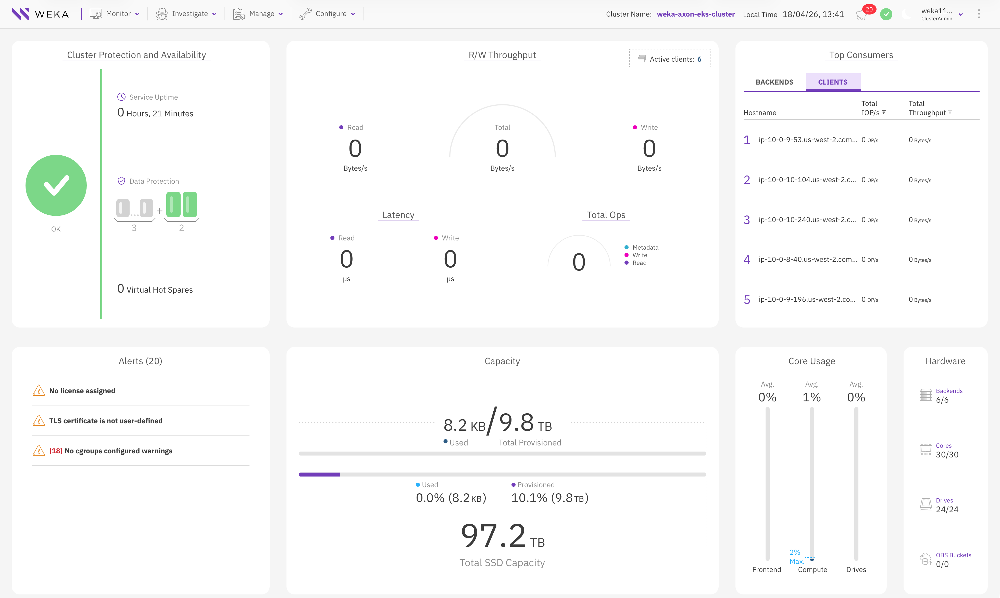

# WEKA Axon on Amazon EKS

Deploy a converged WEKA cluster on Amazon EKS, where backend
(drive + compute), client, and application workloads all run on
the same nodes.

## Architecture

EKS cluster with two node groups
([terraform/eks/](terraform/eks/README.md)):

1. **System nodes** -- Kubernetes components (CoreDNS, kube-proxy,
   VPC CNI), WEKA operator controller, CSI controller.
2. **Axon nodes** -- WEKA drive + compute + client containers and
   application pods. Large instances with local NVMe (e.g.
   i3en.12xlarge, p5.48xlarge).

## Prerequisites

- AWS CLI configured with appropriate permissions
- Existing VPC with subnets (private subnets recommended)
- Terraform >= 1.5
- kubectl, Helm 3.x
- Quay.io credentials for WEKA container images (available at
  [get.weka.io](https://get.weka.io))

## Directory Structure

The module is organized as:

- `terraform/`: Terraform for the converged EKS + WEKA cluster
- `manifests/`: Kubernetes manifests (operator config, WEKA CRs, test pods)
- `deploy.sh`: automated deployment script

```text
weka-axon/
├── terraform/
│   └── eks/             # EKS cluster (WEKA backends run as pods here)
├── manifests/           # Kubernetes manifests
│   ├── core/            # Required manifests (operator, WEKA CRs, StorageClass)
│   └── test/            # Test PVC and pods
└── deploy.sh            # Automated deployment script
```

---

## Deploy Infrastructure

### 1. Deploy EKS Cluster

Provision the EKS control plane and node groups with Terraform.
Start by copying the example variables file:

```bash
cd terraform/eks
cp terraform.tfvars.example terraform.tfvars
```

#### 1.1 Configure Terraform

Edit `terraform.tfvars`. Key variables:

- `region`
- `cluster_name`
- `subnet_ids`
- `admin_role_arn` (IAM role for cluster admin access)
- `enable_ssm_access` (enabled by default for node debugging)
- `hugepages_count`: set **per node group**. See
  [section 2.2](#22-hugepages) for the sizing formula.

See [terraform/eks/README.md](terraform/eks/README.md) for the full
variable reference.

#### 1.2 Node Groups

Node groups are defined as a map. The example below is a base
configuration for testing on `i3en.12xlarge` instances. Adjust
instance type, node count, and resource settings for your
environment.

The axon node group uses a label + taint pattern:

- **Labels** `weka.io/supports-backends=true` and
  `weka.io/supports-clients=true`: positive selectors so
  WEKA-aware workloads (operator node-agent, backend/client
  containers) know which nodes to land on.
- **Taint** `weka.io/axon=true:NoSchedule`: prevents non-WEKA
  workloads from scheduling on these nodes and impacting WEKA or
  application performance. Anything that needs to run here must
  explicitly tolerate the taint.

```hcl
node_groups = {
  system = {
    instance_types = ["m6i.large"]
    desired_size   = 2
    min_size       = 2
    max_size       = 2
    labels = {
      "node-role" = "system"
    }
  }

  axon = {
    instance_types            = ["i3en.12xlarge"]
    desired_size              = 6
    min_size                  = 6
    max_size                  = 6
    subnet_ids                = ["subnet-xxx"]
    disk_size                 = 200
    imds_hop_limit_2          = true
    enable_cpu_manager_static = true
    disable_hyperthreading    = true
    core_count                = 24
    hugepages_count           = 10240
    labels = {
      "weka.io/supports-backends" = "true"
      "weka.io/supports-clients"  = "true"
    }
    taints = [{
      key    = "weka.io/axon"
      value  = "true"
      effect = "NO_SCHEDULE"
    }]
  }
}
```

#### 1.3 Terraform Deployment

Create the EKS cluster (takes about 10-15 minutes):

```bash
terraform init && terraform apply

# Configure kubectl
$(terraform output -raw configure_kubectl)
cd ../..
```

Confirm all nodes are `Ready`:

```bash
kubectl get nodes

NAME                                        STATUS   ROLES    AGE     VERSION
ip-10-0-0-183.us-west-2.compute.internal    Ready    <none>   3h14m   v1.33.8-eks-f69f56f
ip-10-0-10-240.us-west-2.compute.internal   Ready    <none>   3h14m   v1.33.8-eks-f69f56f
ip-10-0-10-104.us-west-2.compute.internal   Ready    <none>   3h14m   v1.33.8-eks-f69f56f
ip-10-0-9-196.us-west-2.compute.internal    Ready    <none>   3h14m   v1.33.8-eks-f69f56f
ip-10-0-9-53.us-west-2.compute.internal     Ready    <none>   3h14m   v1.33.8-eks-f69f56f
ip-10-0-7-157.us-west-2.compute.internal    Ready    <none>   3h14m   v1.33.8-eks-f69f56f
ip-10-0-8-40.us-west-2.compute.internal     Ready    <none>   3h14m   v1.33.8-eks-f69f56f
ip-10-0-8-156.us-west-2.compute.internal    Ready    <none>   3h14m   v1.33.8-eks-f69f56f
```

Verify WEKA axon nodes are labeled:

```bash
kubectl get nodes -l weka.io/supports-backends=true

NAME                                        STATUS   ROLES    AGE     VERSION
ip-10-0-10-240.us-west-2.compute.internal   Ready    <none>   3h14m   v1.33.8-eks-f69f56f
ip-10-0-10-104.us-west-2.compute.internal   Ready    <none>   3h14m   v1.33.8-eks-f69f56f
ip-10-0-9-196.us-west-2.compute.internal    Ready    <none>   3h14m   v1.33.8-eks-f69f56f
ip-10-0-9-53.us-west-2.compute.internal     Ready    <none>   3h14m   v1.33.8-eks-f69f56f
ip-10-0-8-40.us-west-2.compute.internal     Ready    <none>   3h14m   v1.33.8-eks-f69f56f
ip-10-0-8-156.us-west-2.compute.internal    Ready    <none>   3h14m   v1.33.8-eks-f69f56f
```

---

## Automated Kubernetes Setup

Once the Terraform module is applied, `deploy.sh` handles everything
else: operator install, ensure-nics, sign-drives, WekaCluster,
WekaClient, CSI plugin, StorageClass, and a test pod.

If you'd rather walk through each step by hand, skip to
[Manual Kubernetes Setup](#manual-kubernetes-setup).

```bash
./deploy.sh \
  --cluster-name my-eks-cluster \
  --quay-username myuser \
  --quay-password mypass
```

All flags can alternatively be set via environment variables:

| Flag | Environment Variable | Description |
| ---- | -------------------- | ----------- |
| `--cluster-name` | `CLUSTER_NAME` | EKS cluster name |
| `--quay-username` | `QUAY_USERNAME` | Quay.io username |
| `--quay-password` | `QUAY_PASSWORD` | Quay.io password |
| `--region` | `AWS_REGION` | AWS region |
| `--operator-version` | `WEKA_OPERATOR_VERSION` | Operator chart version (default: `v1.11.0`) |

Run `./deploy.sh --help` for all options.

Once `deploy.sh` finishes, head to
[Verify WEKA Processes](#5-verify-weka-processes) to check the
cluster and running processes.

See [Cleanup](#cleanup) for teardown instructions.

---

## Manual Kubernetes Setup

All commands assume you are in the `weka-axon/` directory.

### 1. Deploy WEKA Operator

The [WEKA Operator](https://docs.weka.io/kubernetes/weka-operator-deployments)
manages WEKA storage components via Kubernetes Custom Resources
(WekaCluster, WekaClient). We'll install it with the
[CSI plugin](https://docs.weka.io/appendices/weka-csi-plugin)
enabled, which simplifies secret and StorageClass setup.

Create the namespace:

```bash
kubectl create namespace weka-operator-system
```

Create the Quay pull secret:

```bash
kubectl create secret docker-registry weka-quay-io-secret \
  --namespace weka-operator-system \
  --docker-server=quay.io \
  --docker-username=<QUAY_USERNAME> \
  --docker-password=<QUAY_PASSWORD>
```

Install the operator and CSI plugin:

```bash
helm upgrade --install weka-operator \
  oci://quay.io/weka.io/helm/weka-operator \
  --namespace weka-operator-system \
  --version v1.11.0 \
  --set imagePullSecret=weka-quay-io-secret \
  --set csi.installationEnabled=true \
  -f manifests/core/values-weka-operator.yaml \
  --wait
```

Output:

```bash
Release "weka-operator" does not exist. Installing it now.
Pulled: quay.io/weka.io/helm/weka-operator:v1.11.0
Digest: sha256:646b7ab0f71b170ba8be24b44af08ae04f261034c66cbca451478211e614e854
NAME: weka-operator
LAST DEPLOYED: Mon Apr 13 09:05:43 2026
NAMESPACE: weka-operator-system
STATUS: deployed
REVISION: 1
DESCRIPTION: Install complete
TEST SUITE: None
NOTES:
Chart: weka-operator
Release: weka-operator
```

Verify the pods have deployed:

```bash
kubectl get pods -n weka-operator-system

NAME                                                READY   STATUS    RESTARTS   AGE
weka-operator-controller-manager-54488cb7cc-kpd44   2/2     Running   0          112s
weka-operator-node-agent-bbh5h                      1/1     Running   0          112s
weka-operator-node-agent-fhmlj                      1/1     Running   0          112s
weka-operator-node-agent-k8xv5                      1/1     Running   0          112s
weka-operator-node-agent-mv2cx                      1/1     Running   0          112s
weka-operator-node-agent-r9hw5                      1/1     Running   0          112s
weka-operator-node-agent-zj7hz                      1/1     Running   0          112s
```

You should see one `controller-manager` pod (on system nodes) and
one `node-agent` per WEKA node.

### 2. Prepare Cluster Nodes

The WEKA storage cluster has three process types:

- Compute processes: handle filesystems, cluster-level
  functions, and IO from clients
- Drive processes: manage SSD drives and IO operations to
  the drives
- Frontend (client) processes: manage POSIX client access and
  coordinate IO operations with compute and drive processes

Each process needs a dedicated CPU core and ideally a dedicated
ENI, so WEKA process counts map 1:1 to core counts in the
WekaCluster CR (e.g. `driveCores: 2` → 2 drive processes per
node).

Planning guidelines:

- **1 drive process** per NVMe drive, up to 6 SSDs
  - Above 6 SSDs, use 1 drive process per 2 SSDs
- A ratio of **2 compute processes** per drive process
- **1 frontend process** per node
- Memory requirements (per node):
  - 2.8 GB fixed overhead
  - 2.2 GB per frontend core
  - 3.9 GB per compute core
  - 2 GB per drive core

In AWS, the ENI limit per instance constrains how many processes
you can run. Account for 1 ENI for management and 1 for EKS VPC
CNI. Production Axon deployments typically use larger GPU instances
(p5, p6) which have more ENIs available.

#### 2.1 Example: i3en.12xlarge

| Resource | Value |
| -------- | ----- |
| vCPU | 48 (24 physical cores, 2 threads each) |
| Memory | 384 GiB |
| NVMe | 4 x 7500 GB |
| Max ENIs | 8 |

Per-node allocation:

| Component | Cores | ENIs |
| --------- | ----- | ---- |
| Drive processes | 2 | 2 |
| Compute processes | 3 | 3 |
| Frontend/client | 1 | 1 |
| Management (primary) + EKS VPC CNI | -- | 2 |
| **Total** | **6** | **8** |

Memory: `2.8 + 2.2 + (3.9 × 3) + (2 × 2)` = **~20.7 GB** for
WEKA processes (per the [memory rules in §2 intro](#2-prepare-cluster-nodes)).
Application pods use any of the remaining 18 physical cores and
share the VPC CNI ENI for pod IPs.

This example deviates from the "ideal" ratios in §2's intro.
Strictly following them (4 drive cores + 8 compute cores + 1
client = 13 ENIs) exceeds i3en.12xlarge's 8-ENI max. We trade
drive-process parallelism for staying within the NIC budget
while still using all 4 NVMe drives per node.

#### 2.2 Hugepages

WEKA uses 2 MiB hugepages for all container processes. The node
must have enough total hugepages to cover every container that
will run on it. Each container's request includes a base
allocation plus a DPDK memory component and an offset.

**Per-container formulas:**

| Container | Hugepages (MiB) | Offset (MiB) |
| --------- | --------------- | ------------ |
| Drive | `(1400 * driveCores) + (200 * numDrives) + (64 * driveCores)` | `(200 * numDrives) + (64 * driveCores)` |
| Compute | `computeHugepages + (64 * computeCores)` | `200 + (64 * computeCores)` |
| Client | `(1500 * clientCores) + (64 * clientCores)` | `200 + (64 * clientCores)` |

Each pod requests `hugepages + offset` from the node pool.

Walking through each container for i3en.12xlarge (3 compute
cores, 2 drive cores, 1 client core, numDrives=4):

- **Drive**: hugepages `(1400 × 2) + (200 × 4) + (64 × 2) = 3728`,
  offset `(200 × 4) + (64 × 2) = 928` → **4656 MiB** pod request.
- **Compute**: `computeHugepages` = `3 × 3072 = 9216` (set
  explicitly in the CR). Hugepages `9216 + (64 × 3) = 9408`,
  offset `200 + (64 × 3) = 392` → **9800 MiB** pod request.
- **Client**: hugepages `(1500 × 1) + (64 × 1) = 1564`, offset
  `200 + (64 × 1) = 264` → **1828 MiB** pod request.

| Container | Pod request |
| --------- | ----------- |
| Drive | 4656 MiB |
| Compute | 9800 MiB |
| Client | 1828 MiB |
| **Per-node total** | **16284 MiB** |

Convert to pages: `16284 / 2 = 8142 pages`. Round up with ~25%
headroom to a multiple of 1024: **10240 pages** (20480 MiB).

Set this in `terraform.tfvars`:

```hcl
hugepages_count = 10240
```

Hugepages are configured at node boot via the launch template
user data.

Verify allocation after nodes are running:

```bash
kubectl get nodes -l weka.io/supports-backends=true \
  -o custom-columns=NAME:.metadata.name,HUGEPAGES:.status.allocatable.hugepages-2Mi

NAME                                        HUGEPAGES
ip-10-0-10-240.us-west-2.compute.internal   20Gi
ip-10-0-10-104.us-west-2.compute.internal   20Gi
ip-10-0-9-196.us-west-2.compute.internal    20Gi
ip-10-0-9-53.us-west-2.compute.internal     20Gi
ip-10-0-8-40.us-west-2.compute.internal     20Gi
ip-10-0-8-156.us-west-2.compute.internal    20Gi
```

#### 2.3 Configure NICs

WEKA uses [DPDK](https://docs.weka.io/weka-system-overview/networking-in-wekaio)
for high-performance networking, which requires dedicated ENIs
per WEKA process. The `ensure-nics` WekaPolicy creates and attaches
additional ENIs to each node.

`dataNICsNumber` = total WEKA DPDK NICs + 1 for the EKS VPC CNI.
For this guide's i3en.12xlarge, that's 7 secondary NICs (6 for
WEKA + 1 for VPC CNI; plus 1 primary management NIC = 8 total,
the instance's ENI max). The policy creates the secondary NICs
if they're missing.

Review `manifests/core/ensure-nics.yaml`:

```yaml
apiVersion: weka.weka.io/v1alpha1
kind: WekaPolicy
metadata:
  name: ensure-nics-policy
  namespace: weka-operator-system
spec:
  type: "ensure-nics"
  image: "quay.io/weka.io/weka-in-container:4.4.21.2"
  imagePullSecret: "weka-quay-io-secret"
  payload:
    ensureNICsPayload:
      type: aws
      nodeSelector:
        weka.io/supports-backends: "true"
      dataNICsNumber: 7
```

Apply the policy:

```bash
kubectl apply -f manifests/core/ensure-nics.yaml
```

Wait for completion:

```bash
kubectl get wekapolicies -n weka-operator-system -w
```

Wait until `STATUS` shows `Done`:

```text
NAME                 TYPE          STATUS   PROGRESS
ensure-nics-policy   ensure-nics   Done
```

#### 2.4 Prepare Drives

Local NVMe drives must be discovered and signed before WEKA can
use them. The `sign-drives` WekaPolicy handles this automatically.

For manual drive selection (e.g. only a subset of NVMe drives),
see the [WEKA documentation](https://docs.weka.io/kubernetes/weka-operator-deployments#id-5.-discover-drives-for-weka-cluster-provisioning).

Review `manifests/core/sign-drives.yaml`:

```yaml
apiVersion: weka.weka.io/v1alpha1
kind: WekaPolicy
metadata:
  name: sign-drives-policy
  namespace: weka-operator-system
spec:
  type: sign-drives
  payload:
    signDrivesPayload:
      type: "aws-all"
      nodeSelector:
        weka.io/supports-backends: "true"
```

The main options to note here are

- `type`: set to `aws-all` for AWS deployments
- `nodeSelector`: target only WEKA storage nodes

Apply the policy:

```bash
kubectl apply -f manifests/core/sign-drives.yaml
```

Wait for completion:

```bash
kubectl get wekapolicies -n weka-operator-system -w
```

Wait until `STATUS` shows `Done`:

```text
NAME                 TYPE          STATUS   PROGRESS
ensure-nics-policy   ensure-nics   Done
sign-drives-policy   sign-drives   Done
```

### 3. Deploy WEKA Cluster

The `WekaCluster` CR defines the WEKA backend (drive + compute
containers). Review `manifests/core/weka-cluster.yaml` and adjust
based on resource planning from [section 2](#2-prepare-cluster-nodes):

- `spec.dynamicTemplate`
  - `computeContainers`: total compute containers in the cluster (max 1 per node)
  - `computeCores`: cores per compute container
  - `computeHugepages`: hugepages per compute container (MiB).
    Required with operator v1.11.0. Set to `computeCores * 3072`
    (≈ 3 GiB per compute core; `3072 = 3 * 1024`).
  - `driveContainers`: total drive containers (max 1 per node)
  - `driveCores`: cores per drive container
  - `numDrives`: physical drives assigned per drive container.
    Required with operator v1.11.0.
- `spec.nodeSelector`: targets `weka.io/supports-backends: true`
- `spec.rawTolerations`: `weka.io/axon=true:NoSchedule` so backend
  pods can schedule on tainted nodes
- `spec.image` and `spec.imagePullSecret`: WEKA version and quay.io
  pull secret
- `spec.network.udpMode: false`: use DPDK with dedicated ENIs

**How these fit together:**

- **Drive count**: total physical drives across the cluster equals
  `driveContainers × numDrives`. For 6 i3en.12xlarge nodes with 4
  NVMe each, `driveContainers: 6` and `numDrives: 4` claim all
  24 drives. You can set `numDrives` to lower than the total number
  of drives on a node if you want to reserve some storage for uses
  other than WEKA.
- **DPDK NICs per node**: WEKA allocates one secondary ENI per
  process core: `driveCores + computeCores + clientCores`
  (`clientCores` comes from the WekaClient CR, not here). On
  i3en.12xlarge (8 ENI max), 1 slot is the primary management
  interface and 1 is reserved for the EKS VPC CNI (pod IPs), so
  **6 slots remain for WEKA DPDK**. That's the practical ceiling
  when picking core counts.
- **Hugepages** scale with both core and drive counts. If you
  change any of these values, re-run the calculation in
  [section 2.2](#22-hugepages) and update `hugepages_count` in
  Terraform before applying.

Example for `i3en.12xlarge`:

```yaml
apiVersion: weka.weka.io/v1alpha1
kind: WekaCluster
metadata:
  name: weka-axon-eks-cluster
  namespace: weka-operator-system
spec:
  template: dynamic
  dynamicTemplate:
    computeContainers: 6
    computeCores: 3
    computeHugepages: 9216
    driveContainers: 6
    driveCores: 2
    numDrives: 4
  driversDistService: https://drivers.weka.io
  gracefulDestroyDuration: "0"
  image: quay.io/weka.io/weka-in-container:4.4.21.2
  imagePullSecret: "weka-quay-io-secret"
  network:
    udpMode: false
  nodeSelector:
    weka.io/supports-backends: "true"
  ports:
    basePort: 15000
  rawTolerations:
    - key: "weka.io/axon"
      operator: "Equal"
      value: "true"
      effect: "NoSchedule"
```

Apply the WekaCluster manifest:

```bash
kubectl apply -f manifests/core/weka-cluster.yaml
```

Verify the WEKA cluster is created:

```bash
kubectl get wekacluster -n weka-operator-system -w

NAME                    STATUS          CLUSTER ID                             CCT(A/C/D)   DCT(A/C/D)   DRVS(A/C/D)
weka-axon-eks-cluster   Init
weka-axon-eks-cluster   Init                                                   0/6/6        0/6/6        0/0/24
weka-axon-eks-cluster   Init            679d466a-1382-4562-8c08-c74de34a4362   0/6/6        0/6/6        0/0/24
weka-axon-eks-cluster   WaitForDrives   679d466a-1382-4562-8c08-c74de34a4362   0/6/6        0/6/6        0/0/24
weka-axon-eks-cluster   StartingIO      679d466a-1382-4562-8c08-c74de34a4362   0/6/6        0/6/6        0/0/24
weka-axon-eks-cluster   Ready           679d466a-1382-4562-8c08-c74de34a4362   0/6/6        0/6/6        0/0/24
weka-axon-eks-cluster   Ready           679d466a-1382-4562-8c08-c74de34a4362   6/6/6        6/6/6        24/24/24
```

The `A/C/D` columns are Active / Created / Desired counts for
**C**ompute **C**on**T**ainers, **D**rive **C**on**T**ainers, and
**DR**i**V**e**S**. Wait for `STATUS: Ready` with all counters at
`6/6/6` / `6/6/6` / `24/24/24`.

And you can check that the compute and drive pods are running:

```bash
kubectl get pods -n weka-operator-system | grep -E 'weka-axon-eks-cluster-(compute|drive)'

weka-axon-eks-cluster-compute-044c57f8-c6b5-4349-aefe-2c4f3e7b0e22   1/1     Running   0          3m48s
weka-axon-eks-cluster-compute-2c98e65c-25c4-4790-b0c4-930c1e440148   1/1     Running   0          3m47s
weka-axon-eks-cluster-compute-2d01aef5-e0a2-47e1-993b-7186ad15b389   1/1     Running   0          3m47s
weka-axon-eks-cluster-compute-2fb097e6-e1f0-4f97-9204-33d9756e896a   1/1     Running   0          3m48s
weka-axon-eks-cluster-compute-3817114f-0d60-4af2-8c35-998c2a3330a4   1/1     Running   0          3m47s
weka-axon-eks-cluster-compute-898fae0b-2ddb-4958-b378-2f75906d5c8a   1/1     Running   0          3m48s
weka-axon-eks-cluster-drive-04739f74-8f4a-4a09-94ee-89e52fec4052     1/1     Running   0          3m48s
weka-axon-eks-cluster-drive-11941029-0c8d-43be-9c5c-e2adfa0c481f     1/1     Running   0          3m48s
weka-axon-eks-cluster-drive-977c355a-65a2-4d33-a0f6-0cbda724f394     1/1     Running   0          3m48s
weka-axon-eks-cluster-drive-9e8a6ecc-54a2-4e6b-93cf-7baae64731e2     1/1     Running   0          3m48s
weka-axon-eks-cluster-drive-bef1d7eb-1af4-4057-8e25-d94363790f99     1/1     Running   0          3m48s
weka-axon-eks-cluster-drive-da653d8e-c4d5-4a6b-9628-39d18aed4102     1/1     Running   0          3m48s
```

### 4. Deploy WEKA Client

The `WekaClient` CR creates frontend processes that provide POSIX
access to the cluster. In an Axon deployment, clients run on the
same nodes as the backend. Review `manifests/core/weka-client.yaml`:

```yaml
apiVersion: weka.weka.io/v1alpha1
kind: WekaClient
metadata:
  name: weka-axon-eks-client
  namespace: weka-operator-system
spec:
  autoRemoveTimeout: "24h0m0s"
  coresNum: 1
  cpuPolicy: dedicated
  cpuRequest: "500m"
  driversDistService: https://drivers.weka.io
  image: quay.io/weka.io/weka-in-container:4.4.21.2
  imagePullSecret: "weka-quay-io-secret"
  network:
    udpMode: false
  nodeSelector:
    weka.io/supports-clients: "true"
  portRange:
    basePort: 46000
    portRange: 0
  rawTolerations:
    - key: "weka.io/axon"
      operator: "Equal"
      value: "true"
      effect: "NoSchedule"
  targetCluster:
    name: weka-axon-eks-cluster
    namespace: weka-operator-system
  upgradePolicy:
    type: all-at-once
  wekaHomeConfig: {}
```

Key fields:

- `spec.coresNum`: cores for the client process
- `spec.targetCluster`: points to the local WekaCluster
- `spec.rawTolerations`: allows scheduling on tainted axon nodes

Apply:

```bash
kubectl apply -f manifests/core/weka-client.yaml
```

Verify the client has deployed:

```bash
kubectl get wekaclient -n weka-operator-system

NAME                   STATUS    TARGET CLUSTER          CORES   CONTAINERS(A/C/D)
weka-axon-eks-client   Running   weka-axon-eks-cluster   1       6/6/6
```

`CONTAINERS(A/C/D)` shows Active/Created/Desired. All should
match when ready.

### 5. Verify WEKA Processes

#### 5.1 Client Verification

List the WEKA client pods:

```bash
kubectl get pods -n weka-operator-system -o wide | grep -i client

weka-axon-eks-client-ip-10-0-10-240.us-west-2.compute.internal   1/1     Running   0    3m3s    10.0.10.240   ip-10-0-10-240.us-west-2.compute.internal   <none>           <none>
weka-axon-eks-client-ip-10-0-10-104.us-west-2.compute.internal   1/1     Running   0    3m3s    10.0.10.104   ip-10-0-10-104.us-west-2.compute.internal   <none>           <none>
weka-axon-eks-client-ip-10-0-9-196.us-west-2.compute.internal    1/1     Running   0    3m3s    10.0.9.196    ip-10-0-9-196.us-west-2.compute.internal    <none>           <none>
weka-axon-eks-client-ip-10-0-9-53.us-west-2.compute.internal     1/1     Running   0    3m3s    10.0.9.53     ip-10-0-9-53.us-west-2.compute.internal     <none>           <none>
weka-axon-eks-client-ip-10-0-8-40.us-west-2.compute.internal     1/1     Running   0    3m3s    10.0.8.40     ip-10-0-8-40.us-west-2.compute.internal     <none>           <none>
weka-axon-eks-client-ip-10-0-8-156.us-west-2.compute.internal    1/1     Running   0    3m3s    10.0.8.156    ip-10-0-8-156.us-west-2.compute.internal    <none>           <none>
```

Pick one and run `weka local ps` inside its `weka-container`:

```bash
kubectl exec -n weka-operator-system weka-axon-eks-client-ip-10-0-10-240.us-west-2.compute.internal -c weka-container -- \
  bash -lc 'weka local ps'

CONTAINER           STATE    DISABLED  UPTIME    MONITORING  PERSISTENT   PORT  PID  STATUS  VERSION     LAST FAILURE
3dec9945aea2client  Running  True      0:04:32h  True        True        46001  822  Ready   4.4.21.2
```

#### 5.2 Access WEKA Web UI

The WEKA UI is exposed internally via a **management proxy service**.

Find the service:

```bash
kubectl get svc -n weka-operator-system | grep proxy

weka-axon-eks-cluster-management-proxy             ClusterIP   172.20.218.96   <none>        15305/TCP
```

You can now set up a port-forward:

```bash
kubectl port-forward -n weka-operator-system svc/weka-axon-eks-cluster-management-proxy 15305:15305
```

Access locally in a web browser at:

```bash
http://localhost:15305
```

Retrieve the admin credentials (created by the operator):

```bash
kubectl get secret -n weka-operator-system weka-cluster-weka-axon-eks-cluster \
  -o jsonpath='{.data.username}' | base64 -d; echo

kubectl get secret -n weka-operator-system weka-cluster-weka-axon-eks-cluster \
  -o jsonpath='{.data.password}' | base64 -d; echo
```

Once logged in you should see the cluster:



### 6. WEKA CSI Plugin

#### 6.1 Verify CSI Installation

Because we installed the operator with `csi.installationEnabled=true`,
the CSI plugin, API secret, and default StorageClasses were created
automatically. Verify the CSI pods are running:

```bash
kubectl get pods -n weka-operator-system | grep csi

csi-wekafs-controller-7f9b6d8c54-rvcmg   6/6     Running   2   4m
csi-wekafs-controller-7f9b6d8c54-zmk6b   6/6     Running   3   4m
csi-wekafs-node-654t7                    3/3     Running   2   4m
csi-wekafs-node-nfnh4                    3/3     Running   3   4m
csi-wekafs-node-8mv4p                    3/3     Running   2   4m
csi-wekafs-node-xjq2r                    3/3     Running   4   4m
csi-wekafs-node-k7d9f                    3/3     Running   2   4m
csi-wekafs-node-b3l6n                    3/3     Running   3   4m
```

Non-zero `RESTARTS` counts are expected. CSI pods start with the
operator but require WEKA client containers to be running before
they can serve mounts. They stabilize once clients are active.

Check the API secret and default StorageClasses:

```bash
kubectl get secrets -n weka-operator-system | grep csi

weka-csi-weka-axon-eks-cluster   Opaque   5   39m
```

```bash
kubectl get storageclass | grep weka

weka-weka-axon-eks-cluster-weka-operator-system-default               ...   Delete   Immediate   true   ...
weka-weka-axon-eks-cluster-weka-operator-system-default-forcedirect   ...   Delete   Immediate   true   ...
```

The API secret values are base64-encoded. To decode and inspect:

```bash
kubectl get secret -n weka-operator-system weka-csi-weka-axon-eks-cluster \
  -o json | jq -r '.data | to_entries[] | "\(.key): \(.value | @base64d)"'
```

If you need to create a custom CSI secret (e.g. for a different
cluster), all `data` values must be base64-encoded. Incorrect encoding
is a common source of CSI errors.

#### 6.2 Create StorageClass

We'll create an additional StorageClass with `WaitForFirstConsumer`
binding mode. Review `manifests/core/storageclass-weka.yaml`:

```yaml
apiVersion: storage.k8s.io/v1
kind: StorageClass
metadata:
  name: storageclass-wekafs-dir-api
provisioner: weka-axon-eks-cluster.weka-operator-system.weka.io
allowVolumeExpansion: true
reclaimPolicy: Delete
volumeBindingMode: WaitForFirstConsumer
parameters:
  volumeType: dir/v1
  filesystemName: default
  capacityEnforcement: HARD
  csi.storage.k8s.io/provisioner-secret-name: &secretName weka-csi-weka-axon-eks-cluster
  csi.storage.k8s.io/provisioner-secret-namespace: &secretNamespace weka-operator-system
  csi.storage.k8s.io/controller-publish-secret-name: *secretName
  csi.storage.k8s.io/controller-publish-secret-namespace: *secretNamespace
  csi.storage.k8s.io/controller-expand-secret-name: *secretName
  csi.storage.k8s.io/controller-expand-secret-namespace: *secretNamespace
  csi.storage.k8s.io/node-stage-secret-name: *secretName
  csi.storage.k8s.io/node-stage-secret-namespace: *secretNamespace
  csi.storage.k8s.io/node-publish-secret-name: *secretName
  csi.storage.k8s.io/node-publish-secret-namespace: *secretNamespace
```

Key parameters:

| Parameter             | Options                                        | Description                                                                                                |
|-----------------------|------------------------------------------------|------------------------------------------------------------------------------------------------------------|
| `volumeBindingMode`   | `WaitForFirstConsumer` (default), `Immediate`  | `WaitForFirstConsumer` delays provisioning until a pod uses the PVC - better for topology-aware scheduling |
| `reclaimPolicy`       | `Delete` (default), `Retain`                   | `Delete` removes the volume when PVC is deleted; `Retain` keeps it                                         |
| `filesystemName`      | `default`                                      | WEKA filesystem to use for volumes                                                                         |
| `capacityEnforcement` | `HARD`, `SOFT`                                 | `HARD` enforces quota limits strictly                                                                      |

Make sure `provisioner-secret-name` and `provisioner-secret-namespace`
match your CSI secret.

Create the StorageClass:

```bash
kubectl apply -f manifests/core/storageclass-weka.yaml
```

Verify:

```bash
kubectl get storageclass | grep weka

storageclass-wekafs-dir-api                                           weka-axon-eks-cluster.weka-operator-system.weka.io   Delete   WaitForFirstConsumer   true   105s
weka-weka-axon-eks-cluster-weka-operator-system-default               weka-axon-eks-cluster.weka-operator-system.weka.io   Delete   Immediate              true   14h
weka-weka-axon-eks-cluster-weka-operator-system-default-forcedirect   weka-axon-eks-cluster.weka-operator-system.weka.io   Delete   Immediate              true   14h
```

### 7. Test Dynamic Provisioning

Deploy a test PVC and pods to verify the WEKA CSI integration.

#### 7.1 Create PVC

First create a namespace for our test application:

```bash
kubectl create namespace weka-axon-test
```

A sample PVC is provided:

```yaml
apiVersion: v1
kind: PersistentVolumeClaim
metadata:
  name: pvc-wekafs-dir
  namespace: weka-axon-test
spec:
  accessModes:
    - ReadWriteMany
  storageClassName: storageclass-wekafs-dir-api
  volumeMode: Filesystem
  resources:
    requests:
      storage: 10Gi
```

This creates a 10 GiB `ReadWriteMany` PVC in the
`weka-axon-test` namespace.

Apply:

```bash
kubectl apply -f manifests/test/pvc.yaml
```

And check that it was created:

```bash
kubectl get pvc -n weka-axon-test

NAME             STATUS    VOLUME   CAPACITY   ACCESS MODES   STORAGECLASS                  VOLUMEATTRIBUTESCLASS   AGE
pvc-wekafs-dir   Pending                                      storageclass-wekafs-dir-api   <unset>                 19s
```

Status is **PENDING** because of `WaitForFirstConsumer`. It will
bind once a pod references the PVC.

#### 7.2 Deploy Writer Pod

Deploy a pod that mounts the PVC and writes test data:

```yaml
apiVersion: v1
kind: Pod
metadata:
  name: weka-axon-writer
  namespace: weka-axon-test
spec:
  nodeSelector:
    weka.io/supports-clients: "true"
  tolerations:
    - key: "weka.io/axon"
      operator: "Equal"
      value: "true"
      effect: "NoSchedule"
  containers:
    - name: writer
      image: busybox:1.37.0
      resources:
        requests:
          cpu: 10m
          memory: 16Mi
        limits:
          cpu: 100m
          memory: 64Mi
      command:
        - sh
        - -c
        - |
          echo "Hello from WEKA!" > /data/hello.txt
          ls -la /data
          cat /data/hello.txt
          sleep 3600
      volumeMounts:
        - name: weka-volume
          mountPath: /data
  volumes:
    - name: weka-volume
      persistentVolumeClaim:
        claimName: pvc-wekafs-dir
```

Deploy the application pod:

```bash
kubectl apply -f manifests/test/weka-axon-writer.yaml
```

You can check that the application ran:

```bash
kubectl logs -n weka-axon-test weka-axon-writer

total 4
d---------    1 root     root             0 Feb  5 13:34 .
drwxr-xr-x    1 root     root            63 Feb  5 13:34 ..
-rw-r--r--    1 root     root            17 Feb  5 13:34 hello.txt
Hello from WEKA!
```

You can also now see that the PVC has been bound:

```bash
kubectl get pvc -n weka-axon-test

NAME             STATUS   VOLUME                                     CAPACITY   ACCESS MODES   STORAGECLASS                  VOLUMEATTRIBUTESCLASS   AGE
pvc-wekafs-dir   Bound    pvc-7fc58fbf-5156-4f6f-9b4a-4d7775f8a73e   10Gi       RWX            storageclass-wekafs-dir-api   <unset>                 9m36s
```

#### 7.3 Verify Shared Access (ReadWriteMany)

Verify persistence by deploying a second pod that reads the
same PVC from a different node:

```yaml
apiVersion: v1
kind: Pod
metadata:
  name: weka-axon-reader
  namespace: weka-axon-test
spec:
  nodeSelector:
    weka.io/supports-clients: "true"
  tolerations:
    - key: "weka.io/axon"
      operator: "Equal"
      value: "true"
      effect: "NoSchedule"
  containers:
    - name: reader
      image: busybox:1.37.0
      resources:
        requests:
          cpu: 10m
          memory: 16Mi
        limits:
          cpu: 100m
          memory: 64Mi
      command:
        - sh
        - -c
        - |
          set -eux
          echo "Reading data written by another pod:"
          cat /data/hello.txt
          sleep 3600
      volumeMounts:
        - name: weka-volume
          mountPath: /data
  volumes:
    - name: weka-volume
      persistentVolumeClaim:
        claimName: pvc-wekafs-dir
```

Deploy the pod:

```bash
kubectl apply -f manifests/test/weka-axon-reader.yaml
```

Verify both application pods are running:

```bash
kubectl get pods -n weka-axon-test -o wide

NAME               READY   STATUS    RESTARTS   AGE   IP           NODE                                       NOMINATED NODE   READINESS GATES
weka-axon-writer   1/1     Running   0          12m   10.0.8.218   ip-10-0-8-40.us-west-2.compute.internal    <none>           <none>
weka-axon-reader   1/1     Running   0          14s   10.0.10.140  ip-10-0-10-240.us-west-2.compute.internal  <none>           <none>
```

Examine the logs from the reader pod:

```bash
kubectl logs -n weka-axon-test weka-axon-reader

+ echo 'Reading data written by another pod:'
Reading data written by another pod:
+ cat /data/hello.txt
Hello from WEKA!
+ sleep 3600
```

## Cleanup

### Remove WEKA Components

Quick option (matches `deploy.sh`):

```bash
./deploy.sh --cleanup --cluster-name my-eks-cluster
```

Or manually:

```bash
# Delete test namespace
kubectl delete namespace weka-axon-test

# Delete custom StorageClass
kubectl delete storageclass storageclass-wekafs-dir-api

# Delete WEKA clients
kubectl delete wekaclient -n weka-operator-system --all

# Delete WEKA cluster
kubectl delete wekacluster -n weka-operator-system --all

# Delete ensure-nics and sign-drives policies
kubectl delete wekapolicy -n weka-operator-system --all

# Delete WEKA operator (CSI plugin is uninstalled with it)
helm uninstall weka-operator -n weka-operator-system
kubectl delete namespace weka-operator-system
```

### Destroy Infrastructure

```bash
# From the module root (weka-axon/)
(cd terraform/eks && terraform destroy)
```
