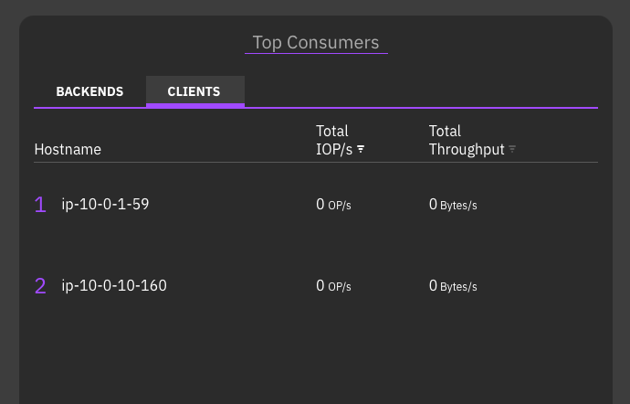

# WEKA Dedicated on EKS

Deploy WEKA client containers on EKS worker nodes connected to
a standalone WEKA backend storage cluster.

## Architecture

<!-- TODO: Add architecture diagram -->
<!--  -->

- **WEKA Backend**: 6+ i3en instances with NVMe storage
  ([terraform/weka-backend/](terraform/weka-backend/README.md))
- **EKS Cluster**: System nodes + WEKA client nodes
  ([terraform/eks/](terraform/eks/README.md))
- **Networking**: WEKA clients connect to backend via dedicated
  NICs (DPDK) or primary interface (UDP)

## Prerequisites

- AWS CLI configured with appropriate permissions
- Terraform >= 1.6
- kubectl, Helm 3.x
- WEKA download token from [get.weka.io](https://get.weka.io)
- Quay.io credentials for WEKA container images (available at
  [get.weka.io](https://get.weka.io))

## Directory Structure

```text
weka-dedicated/
├── terraform/
│   ├── weka-backend/    # WEKA storage cluster
│   └── eks/             # EKS cluster
├── manifests/           # Kubernetes manifests
│   ├── core/            # Required manifests (weka-client, CSI, etc.)
│   └── test/            # Test PVC and pod
├── generate-manifests.sh # Generate weka-client.yaml and CSI secret from backend
└── deploy.sh            # Automated deployment script
```

---

## Manual Deployment

All commands assume you are in the `weka-dedicated/` directory.

## 1. Deploy WEKA Backend

```bash
cd terraform/weka-backend
cp terraform.tfvars.example terraform.tfvars

# Edit terraform.tfvars with your values
terraform init && terraform apply
```

See [terraform/weka-backend/README.md](terraform/weka-backend/README.md)
for configuration details.

Save these outputs for EKS configuration:

```bash
# Security group for EKS nodes (use in additional_node_security_group_ids)
terraform output -json weka_deployment_output | jq -r '.sg_ids[]'

# Get backend IPs for WekaClient configuration
aws ec2 describe-instances \
  --filters "Name=tag:Name,Values=*<cluster_name>*" "Name=instance-state-name,Values=running" \
  --query 'Reservations[].Instances[].PrivateIpAddress' \
  --output text | tr '\t' '\n'
```

## 2. Deploy EKS Cluster

```bash
cd ../eks
cp terraform.tfvars.example terraform.tfvars
```

Edit `terraform.tfvars`:

- Set `additional_node_security_group_ids` to the WEKA backend security group
- Configure WEKA client node group with required settings:

```hcl
node_groups = {
  system = {
    instance_types = ["m6i.large"]
    desired_size   = 2
    min_size       = 1
    max_size       = 3
    disk_size      = 50
  }

  clients = {
    instance_types            = ["c6i.12xlarge"]
    desired_size              = 2
    min_size                  = 1
    max_size                  = 4
    disk_size                 = 100
    imds_hop_limit_2          = true  # Required for ensure-nics
    enable_cpu_manager_static = true  # DPDK CPU allocation
    hugepages_count           = 2048  # ~1.5 GiB per core, rounded up
    labels = {
      "weka.io/supports-clients" = "true"
    }
  }
}
```

```bash
terraform init && terraform apply

# Configure kubectl
$(terraform output -raw configure_kubectl)
cd ../..
```

See [terraform/eks/README.md](terraform/eks/README.md) for configuration details.

## 3. Verify Nodes

```bash
kubectl get nodes
```

Expected output:

```text
NAME                                       STATUS   ROLES    AGE   VERSION
ip-10-0-0-217.eu-west-1.compute.internal   Ready    <none>   45m   v1.33.8-eks-f69f56f
ip-10-0-2-172.eu-west-1.compute.internal   Ready    <none>   45m   v1.33.8-eks-f69f56f
ip-10-0-7-51.eu-west-1.compute.internal    Ready    <none>   45m   v1.33.8-eks-f69f56f
ip-10-0-9-215.eu-west-1.compute.internal   Ready    <none>   45m   v1.33.8-eks-f69f56f
```

Verify WEKA client nodes are labeled:

```bash
kubectl get nodes -l weka.io/supports-clients=true
```

Expected output:

```text
NAME                                         STATUS   ROLES    AGE   VERSION
ip-10-0-1-59.eu-west-1.compute.internal      Ready    <none>   5m    v1.33.8-eks-f69f56f
ip-10-0-10-160.eu-west-1.compute.internal    Ready    <none>   5m    v1.33.8-eks-f69f56f
```

## 4. Deploy WEKA Operator

### 4.1 Create Namespace

```bash
kubectl create namespace weka-operator-system
```

### 4.2 Create Quay.io Pull Secret

```bash
kubectl create secret docker-registry weka-quay-io-secret \
  --namespace weka-operator-system \
  --docker-server=quay.io \
  --docker-username="YOUR_QUAY_USERNAME" \
  --docker-password="YOUR_QUAY_PASSWORD"
```

### 4.3 Install WEKA Operator

```bash
helm upgrade --install weka-operator \
  oci://quay.io/weka.io/helm/weka-operator \
  --namespace weka-operator-system \
  --version v1.11.0 \
  --set imagePullSecret=weka-quay-io-secret \
  -f manifests/core/values-weka-operator.yaml \
  --wait
```

### 4.4 Verify

```bash
kubectl get pods -n weka-operator-system
```

Expected output:

```text
NAME                                                READY   STATUS    RESTARTS   AGE
weka-operator-controller-manager-7977d977fd-hwsxc   2/2     Running   0          81s
weka-operator-node-agent-2pwsb                      1/1     Running   0          82s
weka-operator-node-agent-489fr                      1/1     Running   0          82s
```

## 5. Verify Hugepages

WEKA clients require 2 MiB hugepages. The operator requests
per client pod:

- Hugepages: `coresNum * (1500 + 64)` MiB
- Offset: `200 + 64 * coresNum` MiB
- Total pod request: hugepages + offset

For 2 cores: `2 * 1564 = 3128` + `328` = **3456 MiB** = 1728
pages. The `hugepages_count = 2048` (4096 MiB) in your terraform
provides headroom.

Hugepages are configured at node boot via the launch template
user data. Verify allocation:

```bash
kubectl get nodes -l weka.io/supports-clients=true \
  -o custom-columns=NAME:.metadata.name,HUGEPAGES:.status.allocatable.hugepages-2Mi
```

Expected output:

```text
NAME                                        HUGEPAGES
ip-10-0-1-59.eu-west-1.compute.internal     4Gi
ip-10-0-10-160.eu-west-1.compute.internal   4Gi
```

## 6. Run ensure-nics

Creates dedicated network interfaces for WEKA's DPDK networking.

Edit `manifests/core/ensure-nics.yaml`:

- Set `dataNICsNumber` to `coresNum + 1` (accounts for the EKS VPC CNI interface)

```bash
kubectl apply -f manifests/core/ensure-nics.yaml
```

Wait for completion:

```bash
kubectl get wekapolicies -n weka-operator-system -w
```

Wait until `STATUS` shows `Done`:

```text
NAME                 TYPE          STATUS   PROGRESS
ensure-nics-policy   ensure-nics   Done
```

## 7. Deploy WekaClient

Copy and edit the example manifest:

```bash
cp manifests/core/weka-client.yaml.example manifests/core/weka-client.yaml
```

Edit `manifests/core/weka-client.yaml` with your configuration:

```yaml
apiVersion: weka.weka.io/v1alpha1
kind: WekaClient
metadata:
  name: weka-client
  namespace: weka-operator-system
spec:
  image: quay.io/weka.io/weka-in-container:4.4.21.2
  imagePullSecret: weka-quay-io-secret
  driversDistService: "https://drivers.weka.io"
  portRange:
    basePort: 46000
  nodeSelector:
    weka.io/supports-clients: "true"
  rawTolerations:
    - key: "weka.io/client"
      operator: "Equal"
      value: "true"
      effect: "NoSchedule"

  # Backend IPs from Step 1 (port 14000 for management)
  joinIpPorts:
    - "10.0.67.159:14000"
    - "10.0.67.15:14000"
    - "10.0.66.95:14000"
    - "10.0.65.82:14000"
    - "10.0.64.194:14000"
    - "10.0.67.69:14000"

  # dataNICsNumber in ensure-nics should be coresNum + 1
  coresNum: 2

  # Formula: coresNum × 1564 MiB (1500 base + 64 DPDK per core)
  hugepages: 3072

  network:
    # false = DPDK mode
    # true = UDP mode
    udpMode: false
```

```bash
kubectl apply -f manifests/core/weka-client.yaml
```

Monitor deployment:

```bash
kubectl get wekacontainers -n weka-operator-system -w
```

Expected output when ready:

```text
NAME                                                    STATUS    MODE     MANAGEMENT IPS   NODE                                        AGE
weka-client-ip-10-0-1-59.eu-west-1.compute.internal     Running   client   10.0.1.59        ip-10-0-1-59.eu-west-1.compute.internal     2m43s
weka-client-ip-10-0-10-160.eu-west-1.compute.internal   Running   client   10.0.10.160      ip-10-0-10-160.eu-west-1.compute.internal   2m43s
```

Wait for all containers to show `STATUS: Running`.

Check overall status:

```bash
kubectl get wekaclient -n weka-operator-system
```

```text
NAME          STATUS    TARGET CLUSTER   CORES   CONTAINERS(A/C/D)
weka-client   Running                    2       2/2/2
```

`CONTAINERS(A/C/D)` shows Active/Created/Desired - all should match when ready.

### 7.1 Access WEKA Web UI

The WEKA web UI is available on port 14000 of any backend IP
(or the ALB if configured). If the backend is in a private subnet,
you may need port forwarding or a bastion host.

Retrieve the admin password from Secrets Manager (the command is
shown in the `terraform output` of the weka-backend module).

Verify clients appear under the Clients section with status "UP":



## 8. Deploy WEKA CSI Plugin

### 8.1 Create CSI Namespace

```bash
kubectl create namespace csi-wekafs
```

### 8.2 Create API Secret

Copy and edit the example manifest:

```bash
cp manifests/core/csi-wekafs-api-secret.yaml.example manifests/core/csi-wekafs-api-secret.yaml
```

Edit `manifests/core/csi-wekafs-api-secret.yaml`. All `data`
values must be **base64 encoded**. For example:

```yaml
data:
  username: admin
  password: admin-password
  scheme: https
  endpoints: 10.0.67.159:14000,10.0.67.15:14000,10.0.67.69:14000
  organization: Root
```

would look like this in a base64 encoding:

```yaml
apiVersion: v1
kind: Secret
metadata:
  name: csi-wekafs-api-secret
  namespace: csi-wekafs
type: Opaque
data:
  username: YWRtaW4=
  password: YWRtaW4tcGFzc3dvcmQ=
  scheme: aHR0cHM=
  endpoints: MTAuMC42Ny4xNTk6MTQwMDAsIDEwLjAuNjcuMTU6MTQwMDAsMTAuMC42Ny42OToxNDAwMA==
  organization: Um9vdA==
```

To encode a value:

```bash
echo -n 'your-value' | base64
```

Once you've entered the correct values, create the secret:

```bash
kubectl apply -f manifests/core/csi-wekafs-api-secret.yaml
```

You can use this command to check the values in the secret:

```bash
kubectl get secret csi-wekafs-api-secret -n csi-wekafs -o json | \
  jq -r '.data | to_entries[] | "\(.key): \(.value | @base64d)"'
```

### 8.3 Install CSI Plugin

Add the WEKA CSI helm repo:

```bash
helm repo add csi-wekafs https://weka.github.io/csi-wekafs
helm repo update
```

Review `manifests/core/values-csi-wekafs.yaml`:

```yaml
node:
  nodeSelector:
    weka.io/supports-clients: "true"
  tolerations:
    - key: "weka.io/client"
      operator: "Equal"
      value: "true"
      effect: "NoSchedule"

pluginConfig:
  allowInsecureHttps: true
```

Key settings:

- **nodeSelector**: Restricts CSI node pods to WEKA client nodes only
- **tolerations**: Allows CSI node pods to schedule on tainted client nodes
- **allowInsecureHttps**: Required when the WEKA backend uses self-signed SSL certificates

Install the plugin:

```bash
helm install csi-wekafs csi-wekafs/csi-wekafsplugin \
  --namespace csi-wekafs \
  -f manifests/core/values-csi-wekafs.yaml \
  --wait
```

Verify pods are running:

```bash
kubectl get pods -n csi-wekafs
```

Expected output:

```text
NAME                                     READY   STATUS    RESTARTS   AGE
csi-wekafs-controller-59965597b9-rvcmg   6/6     Running   0          2m40s
csi-wekafs-controller-59965597b9-zmk6b   6/6     Running   0          2m40s
csi-wekafs-node-654t7                    3/3     Running   0          2m40s
csi-wekafs-node-nfnh4                    3/3     Running   0          2m40s
```

You should see:

- Two controller pods (for HA)
- One node pod per labeled EKS node

### 8.4 Create StorageClass

Review `manifests/core/storageclass-weka.yaml` and adjust as needed:

| Parameter             | Options                                        | Description                                                                                                |
|-----------------------|------------------------------------------------|------------------------------------------------------------------------------------------------------------|
| `volumeBindingMode`   | `WaitForFirstConsumer` (default), `Immediate`  | `WaitForFirstConsumer` delays provisioning until a pod uses the PVC - better for topology-aware scheduling |
| `reclaimPolicy`       | `Delete` (default), `Retain`                   | `Delete` removes the volume when PVC is deleted; `Retain` keeps it                                         |
| `filesystemName`      | `default`                                      | WEKA filesystem to use for volumes                                                                         |
| `capacityEnforcement` | `HARD`, `SOFT`                                 | `HARD` enforces quota limits strictly                                                                      |

Create the storage class and then check that it created:

```bash
kubectl apply -f manifests/core/storageclass-weka.yaml
kubectl get storageclass | grep weka
```

---

## Test Dynamic Provisioning

Deploy a test PVC and pod to verify the WEKA CSI integration.

### 9.1 Review Test Manifests

The test manifests in `manifests/test/` include:

**pvc.yaml** - PersistentVolumeClaim:

```yaml
apiVersion: v1
kind: PersistentVolumeClaim
metadata:
  name: pvc-wekafs-dir
  namespace: weka-test
spec:
  accessModes:
    - ReadWriteMany
  storageClassName: storageclass-wekafs-dir-api
  volumeMode: Filesystem
  resources:
    requests:
      storage: 10Gi
```

PVC configuration options:

| Field         | Options                                          | Description                                       |
|---------------|--------------------------------------------------|---------------------------------------------------|
| `accessModes` | `ReadWriteMany`, `ReadWriteOnce`, `ReadOnlyMany` | WEKA supports all modes; RWX allows multiple pods |
| `volumeMode`  | `Filesystem` (default), `Block`                  | `Filesystem` for mounted directories              |
| `storage`     | e.g. `10Gi`, `100Gi`                             | Requested volume size                             |

**weka-mount-test.yaml** - Test pod:

```yaml
apiVersion: v1
kind: Pod
metadata:
  name: weka-pvc-test
  namespace: weka-test
spec:
  nodeSelector:
    weka.io/supports-clients: "true"  # Schedule on WEKA client nodes
  containers:
  - name: test-container
    image: busybox:1.37.0
    volumeMounts:
    - name: weka-volume
      mountPath: "/data"
    command: ["sh", "-c", "echo 'Hello from WEKA!' > /data/hello.txt && ls -la /data && sleep 3600"]
  volumes:
  - name: weka-volume
    persistentVolumeClaim:
      claimName: pvc-wekafs-dir
```

### 9.2 Deploy Test Resources

```bash
kubectl create namespace weka-test
kubectl apply -f manifests/test/
```

### 9.3 Verify PVC Binding

```bash
kubectl get pvc -n weka-test
```

Expected output - PVC should be `Bound`:

```text
NAME             STATUS   VOLUME                                     CAPACITY   ACCESS MODES   STORAGECLASS                  AGE
pvc-wekafs-dir   Bound    pvc-835773b4-c060-455d-94a4-ec2ee85987b9   10Gi       RWX            storageclass-wekafs-dir-api   15s
```

If the PVC stays in `Pending` state, check events:

```bash
kubectl describe pvc pvc-wekafs-dir -n weka-test
```

**Common causes of Pending PVC:**

- API secret values not base64 encoded
- Missing required fields in API secret (`scheme`, `organization`, `endpoints`)
- Incorrect WEKA backend credentials (username/password)
- CSI controller pods not running (check `kubectl get pods -n csi-wekafs`)

### 9.4 Verify Pod Running

```bash
kubectl get pods -n weka-test
```

Expected output:

```text
NAME            READY   STATUS    RESTARTS   AGE
weka-pvc-test   1/1     Running   0          60s
```

### 9.5 Verify Data Written

Check that the pod successfully wrote to the WEKA volume:

```bash
kubectl logs weka-pvc-test -n weka-test
```

Expected output shows directory listing:

```text
total 4
drwxrwxrwx    2 root     root          4096 Jan 12 12:00 .
drwxr-xr-x    1 root     root          4096 Jan 12 12:00 ..
-rw-r--r--    1 root     root            18 Jan 12 12:00 hello.txt
```

Verify file contents:

```bash
kubectl exec weka-pvc-test -n weka-test -- cat /data/hello.txt
```

### 9.6 Cleanup Test Resources

```bash
kubectl delete namespace weka-test
```

---

## Automated Deployment

Two scripts automate the deployment:

1. **`generate-manifests.sh`** -- Queries the WEKA backend to create
   `weka-client.yaml` and `csi-wekafs-api-secret.yaml` with the
   correct backend IPs and credentials.
2. **`deploy.sh`** -- Installs the operator, ensure-nics, client,
   CSI plugin, and runs a test.

### Step 1: Generate Manifests

Run this first. It queries EC2 for the backend IPs and Secrets
Manager for the password, then writes the two YAML files:

```bash
./generate-manifests.sh \
  --backend-name eks-storage-cluster \
  --secret-arn arn:aws:secretsmanager:eu-west-1:123456:secret:weka/...
```

The `--backend-name` is the name tag on your WEKA backend EC2
instances. The `--secret-arn` is the Secrets Manager ARN for the
WEKA admin password (shown in the `terraform output` of the
weka-backend module).

Run `./generate-manifests.sh --help` for all options (cores,
hugepages, UDP mode, etc.).

Review the generated files before proceeding:

```bash
cat manifests/core/weka-client.yaml
cat manifests/core/csi-wekafs-api-secret.yaml
```

### Step 2: Deploy

```bash
./deploy.sh <cluster-name> <quay-username> <quay-password>
```

This runs through all the Kubernetes steps: operator install,
ensure-nics, client deployment, CSI plugin, StorageClass, and a
PVC test.

Arguments can also be passed as environment variables:

| Variable | Description |
| ---------- | ------------- |
| `CLUSTER_NAME` | EKS cluster name |
| `QUAY_USERNAME` | Quay.io username |
| `QUAY_PASSWORD` | Quay.io password |
| `WEKA_OPERATOR_VERSION` | Operator chart version (default: `v1.11.0`) |

To remove everything:

```bash
./deploy.sh --cleanup <cluster-name>
```

Run `./deploy.sh --help` for all options.

---

## Cleanup

### Remove WEKA Components

```bash
# Delete test namespace
kubectl delete namespace weka-test

# Delete CSI plugin
helm uninstall csi-wekafs -n csi-wekafs
kubectl delete namespace csi-wekafs

# Delete WEKA clients
kubectl delete wekaclient -n weka-operator-system --all

# Delete ensure-nics policy
kubectl delete wekapolicy -n weka-operator-system --all

# Delete WEKA operator
helm uninstall weka-operator -n weka-operator-system
kubectl delete namespace weka-operator-system
```

### Destroy Infrastructure

```bash
# Run each from the module root (weka-dedicated/)
(cd terraform/eks && terraform destroy)
(cd terraform/weka-backend && terraform destroy)
```

---

## Troubleshooting

### Quick Checks

```bash
# Pod status
kubectl get pods -n weka-operator-system

# Pod events
kubectl describe pod -n weka-operator-system -l mode=client

# Hugepages
kubectl get nodes -l weka.io/supports-clients=true \
  -o custom-columns=NAME:.metadata.name,HUGEPAGES:.status.allocatable.hugepages-2Mi

# WEKA client logs
kubectl logs -n weka-operator-system -l mode=client
```
